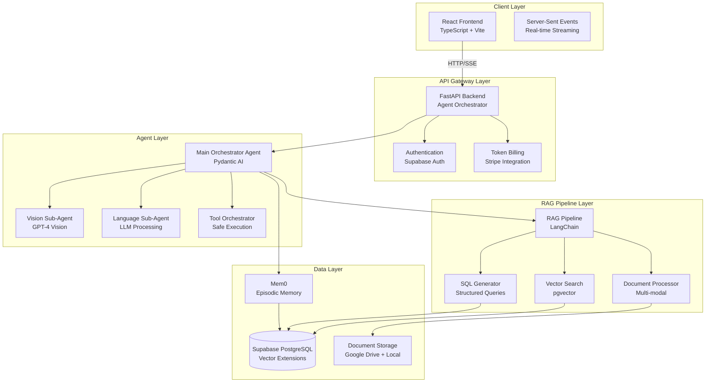
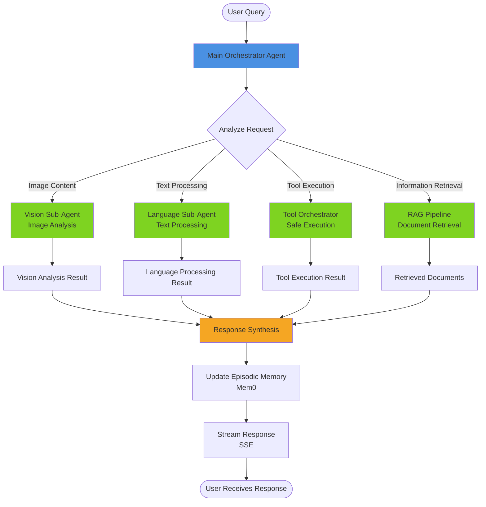
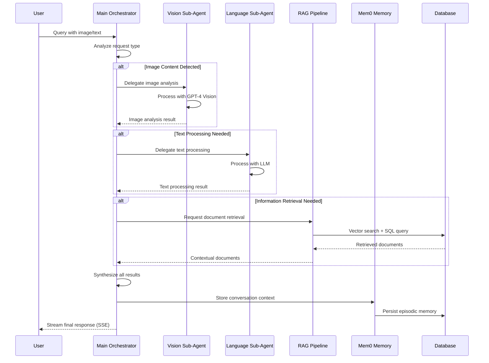
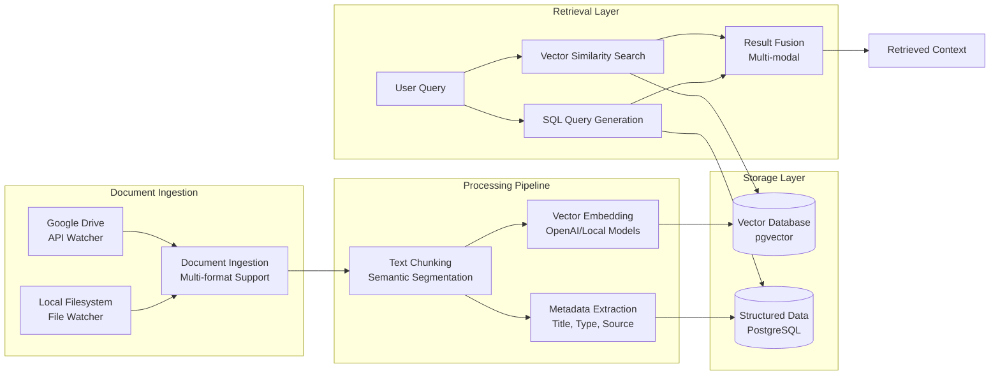
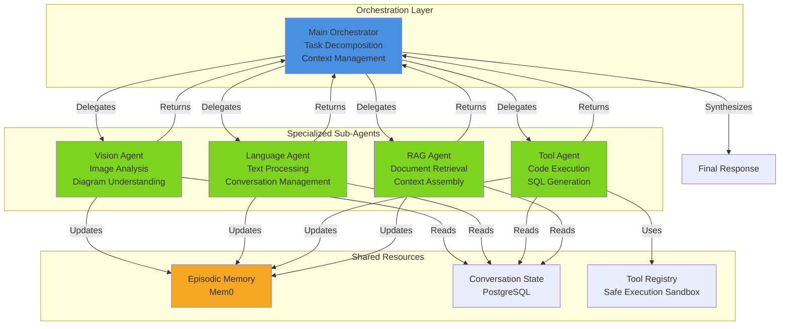
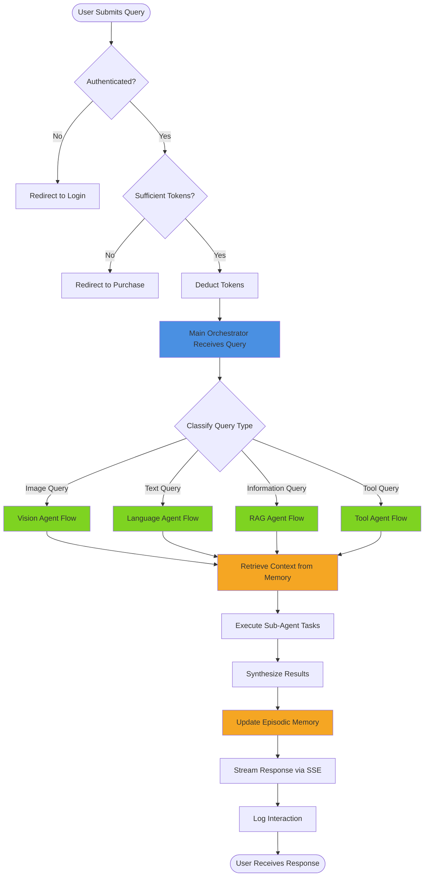
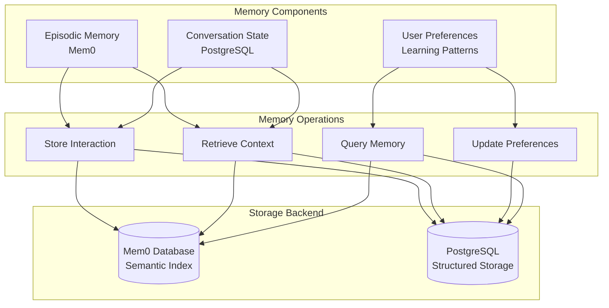
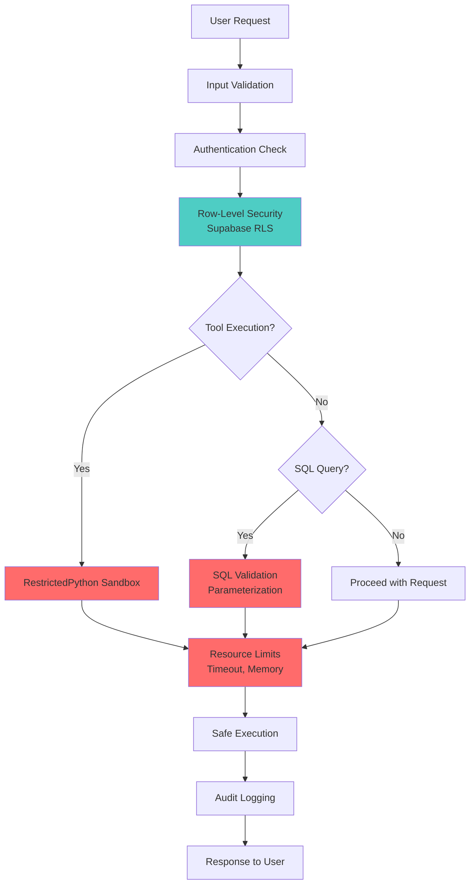

# System Architecture

## Hierarchical Multi-Agent Retrieval System

This document presents the high-level architecture, workflows, and design patterns of the hierarchical multi-agent retrieval system using Mermaid diagrams.

---

## 1. High-Level System Architecture

---

## 2. Hierarchical Multi-Agent Workflow

---

## 3. Sub-Agentic Workflow Detail

---

## 4. RAG Pipeline Workflow

---

## 5. Multi-Agent Coordination Pattern

---

## 6. End-to-End User Query Flow

---

## 7. Memory System Architecture

---

## 8. Security & Safety Architecture

---

## Architecture Principles

### 1. **Hierarchical Delegation**

- Main orchestrator maintains global context
- Specialized sub-agents handle domain-specific tasks
- Clear separation of concerns

### 2. **Semantic Coherence**

- Episodic memory preserves conversation context
- State management across agent boundaries
- Context propagation mechanisms

### 3. **Multi-Modal Retrieval**

- Vector search for semantic similarity
- SQL generation for structured queries
- Vision capabilities for image understanding

### 4. **Production Safety**

- Sandboxed code execution
- Validated SQL queries
- Resource limitations and timeouts

### 5. **Scalability**

- Independent component deployment
- Horizontal scaling at component level
- Modular architecture

---

## Technology Stack

| Layer            | Technology                | Purpose                                 |
| ---------------- | ------------------------- | --------------------------------------- |
| **Frontend**     | React, TypeScript, Vite   | User interface with real-time streaming |
| **Backend API**  | FastAPI, Pydantic AI      | Agent orchestration and API endpoints   |
| **Agents**       | Pydantic AI, GPT-4 Vision | Multi-agent coordination                |
| **RAG Pipeline** | LangChain, pgvector       | Document retrieval and processing       |
| **Database**     | Supabase (PostgreSQL)     | Data persistence with vector extensions |
| **Memory**       | Mem0                      | Episodic memory and context management  |
| **Security**     | RestrictedPython, RLS     | Safe execution and data isolation       |
| **Deployment**   | Docker, Caddy             | Containerization and reverse proxy      |

---

## Contact for Implementation Details

This architecture document provides high-level design patterns and workflows. For complete implementation code, test suites, and deployment configurations, please contact:

**Email**: ateyaterence@gmail.com  
**Subject**: PhD Application - Multi-Agent Systems Research - Implementation Access Request

The private repository (`hierarchical-multi-agent-retrieval-system-impl`) contains:

- Complete source code for all components
- Detailed setup instructions (`SETUP.md`)
- Database schemas and migration scripts
- Deployment configurations
- Test suites and validation frameworks
