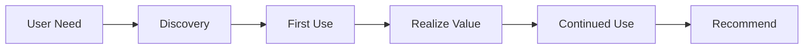
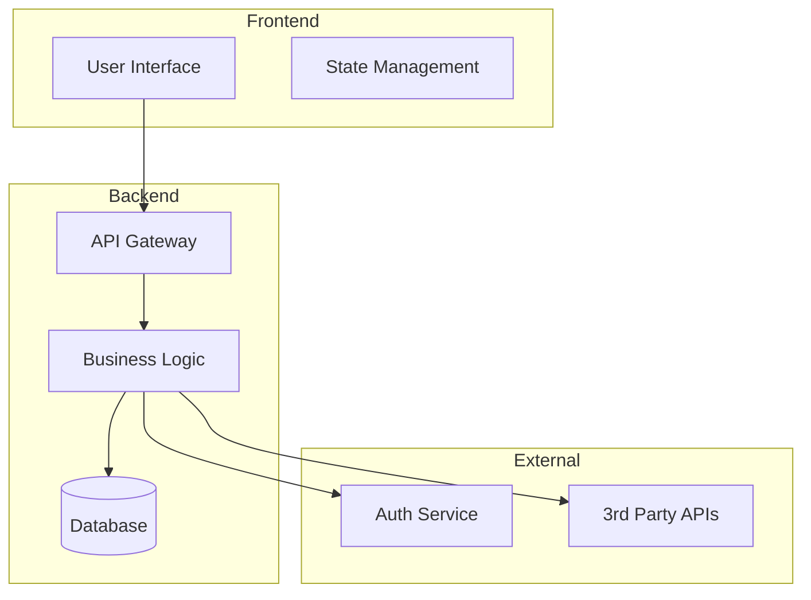
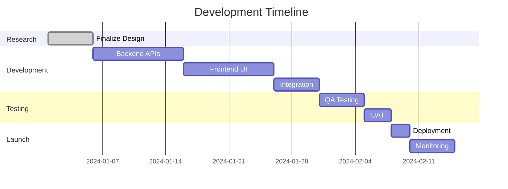

# PRD Generation: $ARGUMENTS

## Phase 1: Requirements Gathering

### Initial Analysis
First, analyze what information was provided about: $ARGUMENTS

**Information Assessment:**
- Core concept clarity: [Clear/Needs clarification]
- Target users mentioned: [Yes/No]
- Technical requirements stated: [Yes/No]
- Compliance/regulations mentioned: [Yes/No]
- Timeline/budget constraints given: [Yes/No]

### Critical Questions Needed

Based on gaps in the provided information, ask the user:

**Business Context:**
- What problem does this solve? Who experiences this problem?
- What's the business goal? (revenue, retention, engagement, efficiency?)
- Timeline expectations? MVP vs full feature?
- Budget or team size constraints?

**User Context:**
- Primary user personas/roles?
- Current workflow or solution they use?
- Expected usage frequency?
- Must-have vs nice-to-have features?

**Technical Context:**
- Existing systems to integrate with?
- Preferred technology stack or constraints?
- Performance requirements (users, data volume, response time)?
- Mobile/desktop/API requirements?

**Compliance & Security:**
- Industry regulations? (HIPAA, SOC2, GDPR, PCI-DSS)
- Data sensitivity level?
- Authentication/authorization needs?
- Audit requirements?

**Success Metrics:**
- How will you measure success?
- Acceptable failure rate?
- Launch criteria?

*Wait for user responses before proceeding to Phase 2*

## Phase 2: Parallel Research Execution

**IMPORTANT**: Based on user's answers, launch 4 specialized research agents simultaneously using the Task tool:

### Agent 1: Internal Codebase Analyst
```
Analyze the existing codebase for implementing "$ARGUMENTS" with context: [user's answers].
Research:
- Current architecture patterns and conventions
- Existing components/modules to leverage
- Similar features already implemented
- Database schema and data models
- API patterns and endpoints
- Authentication/authorization setup
- Testing patterns and coverage requirements
- CI/CD pipeline constraints

Examine actual code files. Map technical dependencies. Return implementation feasibility report.
```

### Agent 2: Market & Competitor Research
```
Research market landscape for "$ARGUMENTS" considering: [user's requirements].
Analyze:
- Direct and indirect competitors
- Feature comparison matrix
- Pricing strategies and models
- Market size and growth trends
- User reviews and pain points
- Differentiation opportunities
- Industry benchmarks and standards

Use web search extensively. Return market positioning strategy with data.
```

### Agent 3: UX Pattern & User Research
```
Research user experience for "$ARGUMENTS" targeting: [user's personas].
Investigate:
- User journey best practices
- Interaction patterns that work
- Accessibility requirements (WCAG 2.1)
- Mobile vs desktop considerations
- Onboarding and adoption strategies
- Error handling and edge cases
- Internationalization needs

Find UX case studies and examples. Return UX recommendation report.
```

### Agent 4: Technical & Compliance Feasibility
```
Assess technical requirements for "$ARGUMENTS" with constraints: [user's compliance needs].
Research:
- Recommended architecture patterns
- Security best practices for [specific regulations mentioned]
- Performance optimization strategies
- Scalability considerations
- Third-party service options
- Cost estimation for infrastructure
- Risk assessment and mitigation

Focus on [specific compliance] if mentioned. Return technical blueprint with compliance checklist.
```

## Phase 3: Synthesis & PRD Creation

### Executive Summary
**Product:** [Name]
**Problem:** [Synthesized from research]
**Solution:** [Proposed approach]
**Impact:** [Business value]

### Market Opportunity
[Synthesize Agent 2 findings]
- Market size: $[X]B growing at [Y]%
- Competitive advantage: [Key differentiators]
- Target segments: [Prioritized list]

### User Personas & Journeys
[Synthesize Agent 3 findings]

**Primary Persona:**
- Role: [Title/Description]
- Goals: [What they want to achieve]
- Pain Points: [Current frustrations]
- Success Looks Like: [Desired outcome]

**User Flow:**


### Technical Architecture
[Synthesize Agents 1 & 4 findings]

**System Design:**


**Technology Decisions:**
- Frontend: [Based on existing stack]
- Backend: [Based on existing patterns]
- Database: [Schema considerations]
- Infrastructure: [Deployment strategy]

### Functional Requirements

**Must Have (P0):**
1. [Core feature 1 with acceptance criteria]
2. [Core feature 2 with acceptance criteria]
3. [Core feature 3 with acceptance criteria]

**Should Have (P1):**
1. [Enhancement 1]
2. [Enhancement 2]

**Could Have (P2):**
1. [Future consideration 1]
2. [Future consideration 2]

### Non-Functional Requirements

**Performance:**
- Response time: <[X]ms p95
- Throughput: [Y] requests/second
- Availability: [99.9]% uptime

**Security & Compliance:**
[Based on user's specific requirements]
- Authentication: [Method]
- Authorization: [RBAC/ABAC]
- Data encryption: [At rest/In transit]
- Compliance: [Specific standards]
- Audit logging: [Requirements]

### Implementation Plan



**Phase 1: Foundation (Week 1-2)**
- Set up infrastructure
- Create data models
- Build core APIs

**Phase 2: Core Features (Week 3-4)**
- Implement must-have features
- Create UI components
- Integration testing

**Phase 3: Polish (Week 5)**
- Add should-have features
- Performance optimization
- Security review

**Phase 4: Launch (Week 6)**
- User acceptance testing
- Deployment preparation
- Monitoring setup

### Success Metrics

**Primary KPIs:**
- [Metric 1]: Target [X], measured by [method]
- [Metric 2]: Target [Y], measured by [method]
- [Metric 3]: Target [Z], measured by [method]

**Secondary Metrics:**
- User adoption rate
- Performance benchmarks
- Error rates
- Support tickets

### Risk Assessment

| Risk | Probability | Impact | Mitigation |
|------|------------|--------|------------|
| [Technical risk] | Medium | High | [Strategy] |
| [Market risk] | Low | Medium | [Strategy] |
| [Resource risk] | Medium | Medium | [Strategy] |

### Dependencies
- Internal: [Team/system dependencies]
- External: [Third-party dependencies]
- Regulatory: [Compliance dependencies]

### Open Questions
1. [Unresolved question requiring stakeholder input]
2. [Technical decision needing architect review]
3. [UX question needing user research]

### Appendices
- A. Competitive Analysis Details
- B. Technical Specifications
- C. Compliance Checklist
- D. Research Findings Summary

---

**PRD Status:** [Draft/Ready for Review/Approved]
**Next Steps:** Review with stakeholders → Create implementation tasks → Begin development

## Phase 4: Save PRD Document

### File Creation
Save the completed PRD as a markdown file:

**Location:** `PRDs/[feature-name]-prd.md`

Where `[feature-name]` is a sanitized version of the product/feature name:
- Replace spaces with hyphens
- Remove special characters
- Use lowercase
- Include date prefix if needed: `YYYY-MM-DD-feature-name-prd.md`

**Example:**
- Input: "User Authentication System"
- Output: `PRDs/user-authentication-system-prd.md`

### Directory Structure
```
PRDs/
├── user-authentication-prd.md
├── payment-processing-prd.md
├── analytics-dashboard-prd.md
└── archived/
    └── 2024-old-feature-prd.md
```

### Final Checklist
Before saving, verify:
- [ ] All user questions were answered
- [ ] All 4 research agents completed
- [ ] Technical architecture documented
- [ ] Compliance requirements addressed
- [ ] Success metrics defined
- [ ] Risk assessment complete
- [ ] Mermaid diagrams rendered correctly
- [ ] Timeline is realistic
- [ ] File saved in PRDs directory