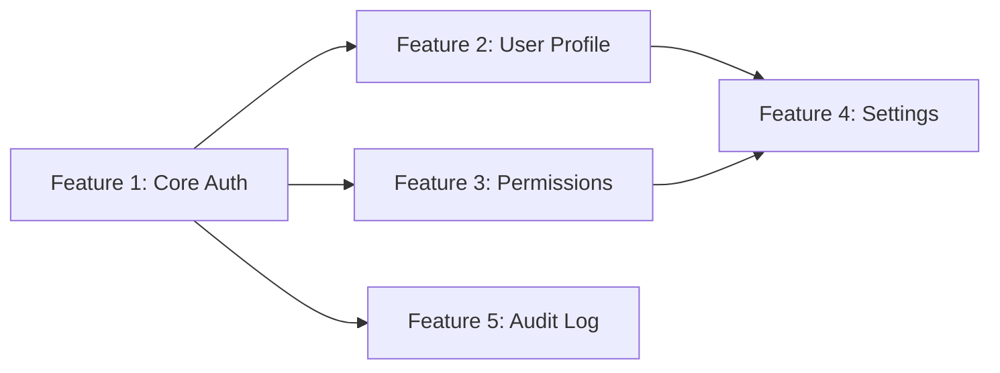
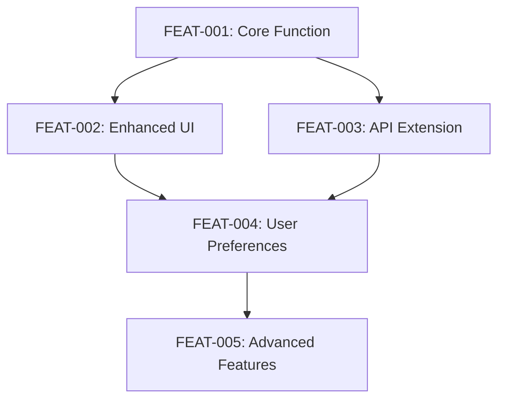

# PRD Breakdown: $1

**Breakdown Level:** $2 (auto-detect if not specified)

## Phase 1: PRD Analysis

### 1. Load and Analyze PRD

Read the PRD from: $1 (or `PRDs/` directory if path not provided)

**Scope Assessment:**
- Document size: [Large/Medium/Small]
- Number of major sections: [count]
- Feature complexity: [Multi-feature system/Single feature/Simple enhancement]
- User personas identified: [count]
- Technical components: [count]

### 2. Determine Breakdown Strategy

**Auto-Detection Logic:**
```
IF PRD describes multiple distinct capabilities (>3 major functions):
    → Break into FEATURES
ELIF PRD describes single feature with multiple user flows:
    → Break into USER STORIES
ELSE:
    → Break into TASKS
```

**Scope Indicators:**
- Multi-feature: Payment system, User management, Analytics dashboard
- Single feature: Password reset, Export functionality, Search feature
- Enhancement: Performance optimization, UI update, Bug fix

## Phase 2: Feature-Level Breakdown

**(Use when PRD contains multiple features)**

### Feature Extraction Template

For each major capability in the PRD, create:

**Feature #1: [Name]**
```yaml
feature_name: "[Descriptive Name]"
epic: "[Parent Epic]"
priority: [P0/P1/P2]
estimated_effort: "[T-shirt size: S/M/L/XL]"
dependencies: ["feature_x", "external_api"]
```

**Description:**
[2-3 sentences describing the feature's purpose and value]

**User Stories:**
1. As a [user], I want to [action] so that [benefit]
2. As a [user], I want to [action] so that [benefit]
3. As a [user], I want to [action] so that [benefit]

**Acceptance Criteria:**
- [ ] [Measurable criterion]
- [ ] [Measurable criterion]
- [ ] [Measurable criterion]

**Technical Components:**
- API endpoints: [list]
- Database changes: [list]
- UI components: [list]
- External integrations: [list]

---

### Feature Dependency Map



### Feature Prioritization Matrix

| Feature | Business Value | Technical Effort | Risk | Priority | Sprint |
|---------|---------------|------------------|------|----------|--------|
| [Name] | High/Med/Low | S/M/L/XL | Low/Med/High | P0 | Sprint 1 |
| [Name] | High/Med/Low | S/M/L/XL | Low/Med/High | P1 | Sprint 2 |

## Phase 3: User Story Breakdown

**(Use when PRD describes a single feature)**

### Story Mapping Structure

**Epic: [Feature Name from PRD]**

#### User Activities (Horizontal)
```
[Discovery] → [First Use] → [Regular Use] → [Advanced Use] → [Administration]
```

#### User Stories (Vertical by Priority)

**Must Have (P0) - Sprint 1:**
```
Story ID: [FEAT-001]
Title: Basic [Feature] Functionality
As a: [primary user]
I want to: [core action]
So that: [primary value]

Acceptance Criteria:
- Given [precondition], when [action], then [result]
- Given [precondition], when [action], then [result]

Tasks:
- [ ] Design database schema
- [ ] Create API endpoint
- [ ] Build UI component
- [ ] Write unit tests
- [ ] Update documentation

Story Points: [1-13]
```

**Should Have (P1) - Sprint 2:**
```
Story ID: [FEAT-002]
Title: Enhanced [Feature] Options
[Repeat structure above]
```

**Could Have (P2) - Backlog:**
```
Story ID: [FEAT-003]
Title: Advanced [Feature] Settings
[Repeat structure above]
```

### Story Dependency Chain



## Phase 4: Task-Level Breakdown

**(Use for simple enhancements or when stories need decomposition)**

### Task Decomposition

For each user story or enhancement, create atomic tasks:

**Parent: [Story/Feature ID]**

#### Development Tasks

**Backend Tasks:**
```markdown
TASK-001: Create Data Model
- Description: Design and implement [entity] model
- Acceptance: Schema reviewed, migrations created
- Estimate: 4 hours
- Assignee: Backend
- Dependencies: None

TASK-002: Implement Business Logic
- Description: Create service layer for [feature]
- Acceptance: Unit tests pass, logic reviewed
- Estimate: 8 hours
- Assignee: Backend
- Dependencies: TASK-001
```

**Frontend Tasks:**
```markdown
TASK-003: Create UI Components
- Description: Build React/Vue/Angular components
- Acceptance: Component renders, props validated
- Estimate: 6 hours
- Assignee: Frontend
- Dependencies: Design approval

TASK-004: Integrate with API
- Description: Connect UI to backend endpoints
- Acceptance: Data flows correctly, errors handled
- Estimate: 4 hours
- Assignee: Frontend
- Dependencies: TASK-002, TASK-003
```

**Quality Tasks:**
```markdown
TASK-005: Write Integration Tests
- Description: End-to-end test scenarios
- Acceptance: 80% coverage, all pass
- Estimate: 4 hours
- Assignee: QA
- Dependencies: TASK-004

TASK-006: Performance Testing
- Description: Load and stress testing
- Acceptance: Meets SLA requirements
- Estimate: 3 hours
- Assignee: QA
- Dependencies: TASK-005
```

### Task Board View

```
TODO                IN PROGRESS         IN REVIEW          DONE
----                -----------         ---------          ----
TASK-001 (4h)      TASK-003 (6h)      TASK-002 (8h)
TASK-004 (4h)
TASK-005 (4h)
TASK-006 (3h)
```

## Phase 5: Work Breakdown Structure (WBS)

### Hierarchical View

```
PRD: [Product Name]
├── Feature 1: [Name]
│   ├── Story 1.1: [Title]
│   │   ├── Task 1.1.1: Backend setup
│   │   ├── Task 1.1.2: API development
│   │   └── Task 1.1.3: Frontend integration
│   ├── Story 1.2: [Title]
│   │   ├── Task 1.2.1: Data model
│   │   └── Task 1.2.2: Business logic
│   └── Story 1.3: [Title]
├── Feature 2: [Name]
│   ├── Story 2.1: [Title]
│   └── Story 2.2: [Title]
└── Feature 3: [Name]
```

### Effort Estimation Summary

**Total Effort by Level:**
- Features: [X] story points
- Stories: [Y] story points
- Tasks: [Z] hours

**Sprint Allocation:**
- Sprint 1: [Features/Stories/Tasks list] - [points/hours]
- Sprint 2: [Features/Stories/Tasks list] - [points/hours]
- Sprint 3: [Features/Stories/Tasks list] - [points/hours]
- Backlog: [Features/Stories/Tasks list] - [points/hours]

## Phase 6: Export Formats

### 1. JIRA/Linear Format

Save as: `PRDs/[feature-name]-jira-import.csv`

```csv
Issue Type,Summary,Description,Acceptance Criteria,Story Points,Priority,Sprint,Epic
Story,"[Title]","[Description]","[Criteria]",5,High,Sprint 1,[Epic Name]
Task,"[Title]","[Description]","[Criteria]",0,High,Sprint 1,[Parent Story]
```

### 2. GitHub Issues Format

Save as: `PRDs/[feature-name]-github-issues.md`

```markdown
## Issue: [Title]
**Type:** Story/Task
**Priority:** P0/P1/P2
**Estimate:** [points/hours]
**Sprint:** [number]

### Description
[Detailed description]

### Acceptance Criteria
- [ ] [Criterion 1]
- [ ] [Criterion 2]

### Technical Notes
[Implementation guidance]
```

### 3. Agile Board Format

Save as: `PRDs/[feature-name]-board.md`

```markdown
# Sprint Board: [Feature Name]

## Sprint 1
### TODO
- [ ] STORY-001: [Title] (5 pts)
  - [ ] TASK-001: [Title] (2h)
  - [ ] TASK-002: [Title] (4h)

### IN PROGRESS
- [ ] STORY-002: [Title] (3 pts)

### DONE
- [x] STORY-000: Setup (1 pt)
```

## Phase 7: Save Breakdown

### File Organization

```
PRDs/
├── [feature]-prd.md                 # Original PRD
├── [feature]-breakdown/
│   ├── features.md                  # Feature-level breakdown
│   ├── user-stories.md             # Story-level breakdown
│   ├── tasks.md                    # Task-level breakdown
│   ├── wbs.md                      # Work breakdown structure
│   ├── exports/
│   │   ├── jira-import.csv
│   │   ├── github-issues.md
│   │   └── sprint-board.md
│   └── diagrams/
│       ├── dependency-map.mmd
│       └── story-map.mmd
```

### Summary Report

**Breakdown Complete:**
- Original PRD: `$1`
- Breakdown level: [Features/Stories/Tasks]
- Total items created: [count]
- Estimated total effort: [points/hours]
- Suggested team size: [number]
- Estimated timeline: [weeks]
- Files created: [list]

**Next Steps:**
1. Review breakdown with team
2. Import to project management tool
3. Assign team members
4. Begin Sprint 1 planning
5. Create development branches