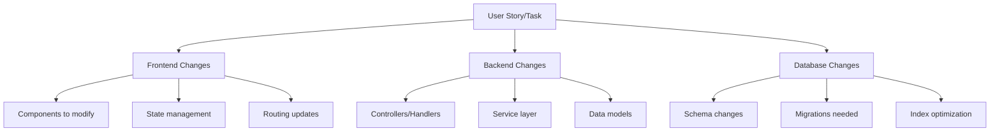
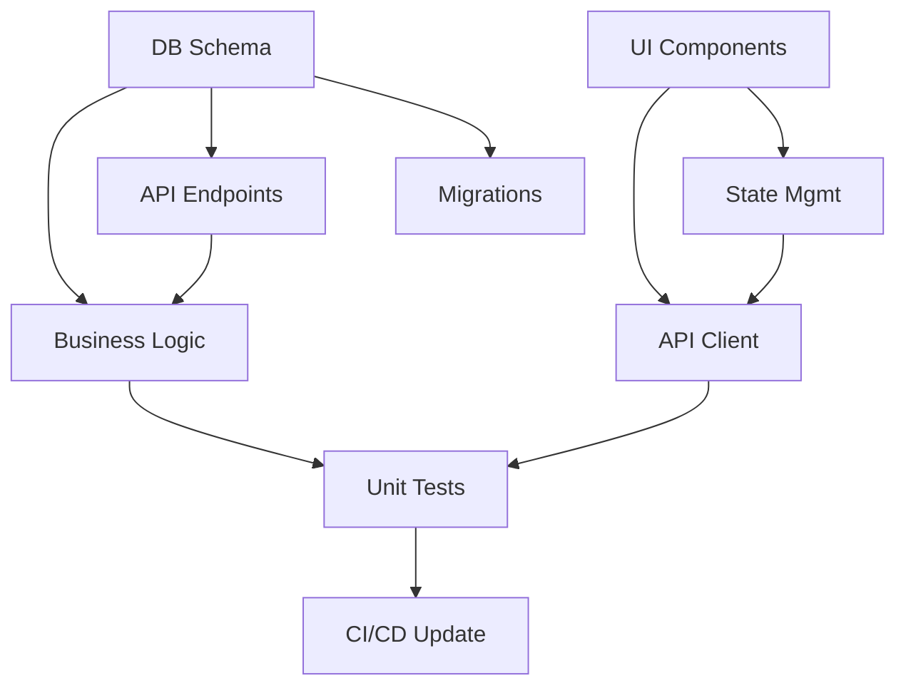

# Technical Breakdown: $1

**Analysis Depth:** $2 (defaults to deep)

## Phase 1: Context Analysis

### 1. Story/Task Understanding

Analyze the story/task: $1

**Input Type Detection:**
- Story ID: [FEAT-XXX]
- Task description: [parsed description]
- Feature area: [identified from context]
- User impact: [frontend/backend/fullstack]

### 2. Codebase Discovery

Perform comprehensive code analysis to understand:

**Repository Structure:**
```bash
# Scan project structure
- Framework/language detection
- Architecture pattern (MVC, microservices, etc.)
- Test framework and coverage
- Build/deployment setup
```

**Relevant Code Areas:**
```bash
# Search for related code
- Existing similar features
- Reusable components/utilities
- Database models/schemas
- API endpoints
- UI components
```

## Phase 2: Code Intelligence Gathering

### 1. Pattern Recognition

**Search Existing Patterns:**
```
Look for:
- Similar feature implementations
- Naming conventions (functions, classes, files)
- Error handling patterns
- Testing patterns
- Authentication/authorization flows
- Data validation approaches
```

### 2. Integration Point Mapping

**System Integration Analysis:**


## Phase 3: Technical Subtask Generation

### Backend Subtasks

**SUBTASK-001: Database Schema Design**
```yaml
title: "Create/Update database schema for [feature]"
type: backend
priority: P0
estimate: 2-4 hours
```

**Technical Details:**
```sql
-- Suggested schema based on codebase patterns
CREATE TABLE IF NOT EXISTS [table_name] (
    id SERIAL PRIMARY KEY,
    [field_name] VARCHAR(255) NOT NULL,
    created_at TIMESTAMP DEFAULT CURRENT_TIMESTAMP,
    updated_at TIMESTAMP DEFAULT CURRENT_TIMESTAMP
);

-- Indexes based on query patterns
CREATE INDEX idx_[table]_[field] ON [table]([field]);
```

**Integration Points:**
- Models: `app/models/[ModelName].py` (following pattern from `app/models/User.py`)
- Migration: `migrations/[timestamp]_add_[feature]_table.sql`
- ORM mapping: Update `app/models/__init__.py`

**Function Signatures:**
```python
# Suggested based on existing patterns in codebase
class [ModelName](BaseModel):
    """Following pattern from app/models/base.py"""

    @classmethod
    async def create_[entity](cls, data: Dict) -> '[ModelName]':
        """Pattern from app/models/user.py:45"""
        pass

    async def update_[entity](self, data: Dict) -> bool:
        """Pattern from app/models/user.py:67"""
        pass
```

---

**SUBTASK-002: API Endpoint Implementation**
```yaml
title: "Create REST API endpoints for [feature]"
type: backend
priority: P0
estimate: 3-4 hours
dependencies: [SUBTASK-001]
```

**Endpoint Definitions:**
```python
# Following routing pattern from app/routes/users.py
router = APIRouter(prefix="/api/[feature]", tags=["[feature]"])

@router.get("/", response_model=List[FeatureSchema])
async def get_[features](
    skip: int = 0,
    limit: int = 100,
    db: Session = Depends(get_db)
):
    """Pattern from app/routes/users.py:23"""
    pass

@router.post("/", response_model=FeatureSchema)
async def create_[feature](
    data: CreateFeatureSchema,
    db: Session = Depends(get_db),
    current_user: User = Depends(get_current_user)
):
    """Pattern from app/routes/users.py:34"""
    pass
```

**Files to Create/Modify:**
- Create: `app/routes/[feature].py`
- Update: `app/routes/__init__.py` (register router)
- Create: `app/schemas/[feature].py` (Pydantic models)
- Update: `app/main.py` (include router)

---

**SUBTASK-003: Business Logic Service Layer**
```yaml
title: "Implement [feature] business logic"
type: backend
priority: P0
estimate: 4-6 hours
dependencies: [SUBTASK-001, SUBTASK-002]
```

**Service Implementation:**
```python
# Following service pattern from app/services/user_service.py
class [Feature]Service:
    """Business logic for [feature] following app/services pattern"""

    def __init__(self, db: Session):
        self.db = db

    async def process_[feature](self, data: Dict) -> Result:
        """
        Main business logic following pattern from:
        - app/services/payment_service.py:process_payment()
        - app/services/notification_service.py:send_notification()
        """
        # Validation (pattern from app/validators/)
        validated_data = await self._validate_[feature](data)

        # Business rules (pattern from app/rules/)
        if not await self._check_business_rules(validated_data):
            raise BusinessRuleViolation()

        # Process
        result = await self._execute_[feature](validated_data)

        # Audit log (pattern from app/utils/audit.py)
        await audit_log(action="[feature]_processed", data=result)

        return result
```

**Integration Files:**
- Create: `app/services/[feature]_service.py`
- Create: `app/validators/[feature]_validator.py`
- Update: `app/services/__init__.py`
- Create: `tests/services/test_[feature]_service.py`

### Frontend Subtasks

**SUBTASK-004: UI Component Development**
```yaml
title: "Create React/Vue/Angular components for [feature]"
type: frontend
priority: P0
estimate: 4-6 hours
dependencies: []
```

**Component Structure:**
```typescript
// Following component pattern from src/components/UserProfile/
// src/components/[Feature]/[Feature].tsx

import React, { useState, useEffect } from 'react';
import { use[Feature]Hook } from '../../hooks/use[Feature]';
import { [Feature]Props } from './types';
import styles from './[Feature].module.css';

export const [Feature]: React.FC<[Feature]Props> = ({
    initialData,
    onUpdate,
    ...props
}) => {
    // Following state pattern from src/components/UserProfile/UserProfile.tsx:15
    const { data, loading, error } = use[Feature]Hook(initialData);

    // Following effect pattern from src/components/Dashboard/Dashboard.tsx:28
    useEffect(() => {
        // Initialization logic
    }, []);

    return (
        <div className={styles.container}>
            {/* Component JSX */}
        </div>
    );
};
```

**Files to Create:**
```
src/components/[Feature]/
├── index.ts                    # Export barrel
├── [Feature].tsx               # Main component
├── [Feature].test.tsx          # Unit tests
├── [Feature].module.css        # Styles
├── types.ts                    # TypeScript types
└── components/                 # Sub-components
    ├── [Feature]List.tsx
    └── [Feature]Item.tsx
```

---

**SUBTASK-005: State Management Integration**
```yaml
title: "Integrate [feature] with Redux/Zustand/Context"
type: frontend
priority: P0
estimate: 2-3 hours
dependencies: [SUBTASK-004]
```

**State Management:**
```typescript
// Following Redux pattern from src/store/slices/userSlice.ts
// src/store/slices/[feature]Slice.ts

import { createSlice, createAsyncThunk } from '@reduxjs/toolkit';
import { [Feature]API } from '../../api/[feature]';

// Async thunks (pattern from src/store/slices/userSlice.ts:12)
export const fetch[Features] = createAsyncThunk(
    '[feature]/fetchAll',
    async (params: FetchParams) => {
        return await [Feature]API.getAll(params);
    }
);

// Slice (pattern from src/store/slices/userSlice.ts:25)
const [feature]Slice = createSlice({
    name: '[feature]',
    initialState: {
        items: [],
        loading: false,
        error: null
    },
    reducers: {
        // Synchronous actions
    },
    extraReducers: (builder) => {
        // Async action handlers
    }
});
```

**Integration Points:**
- Create: `src/store/slices/[feature]Slice.ts`
- Update: `src/store/index.ts` (register reducer)
- Create: `src/hooks/use[Feature].ts` (custom hook)
- Update: `src/types/index.ts` (TypeScript types)

### API Integration Subtasks

**SUBTASK-006: API Client Implementation**
```yaml
title: "Create API client methods for [feature]"
type: frontend
priority: P0
estimate: 2 hours
dependencies: [SUBTASK-002]
```

**API Client:**
```typescript
// Following pattern from src/api/client.ts
// src/api/[feature].ts

import { apiClient } from './client';
import { [Feature], Create[Feature]DTO } from '../types';

export const [Feature]API = {
    // Pattern from src/api/users.ts:8
    getAll: async (params?: QueryParams): Promise<[Feature][]> => {
        const response = await apiClient.get('/[feature]', { params });
        return response.data;
    },

    // Pattern from src/api/users.ts:14
    getById: async (id: string): Promise<[Feature]> => {
        const response = await apiClient.get(`/[feature]/${id}`);
        return response.data;
    },

    // Pattern from src/api/users.ts:20
    create: async (data: Create[Feature]DTO): Promise<[Feature]> => {
        const response = await apiClient.post('/[feature]', data);
        return response.data;
    }
};
```

### Testing Subtasks

**SUBTASK-007: Unit Test Implementation**
```yaml
title: "Write comprehensive unit tests"
type: testing
priority: P1
estimate: 3-4 hours
dependencies: [SUBTASK-003, SUBTASK-004]
```

**Backend Tests:**
```python
# Following test pattern from tests/test_user_service.py
# tests/test_[feature]_service.py

import pytest
from unittest.mock import Mock, patch
from app.services.[feature]_service import [Feature]Service

class Test[Feature]Service:
    """Pattern from tests/test_user_service.py:12"""

    @pytest.fixture
    def service(self, db_session):
        """Pattern from tests/conftest.py:45"""
        return [Feature]Service(db_session)

    async def test_create_[feature]_success(self, service):
        """Pattern from tests/test_user_service.py:23"""
        # Arrange
        test_data = {"field": "value"}

        # Act
        result = await service.create_[feature](test_data)

        # Assert
        assert result.id is not None
        assert result.field == "value"
```

**Frontend Tests:**
```typescript
// Following test pattern from src/components/User/User.test.tsx
// src/components/[Feature]/[Feature].test.tsx

import { render, screen, fireEvent, waitFor } from '@testing-library/react';
import { [Feature] } from './[Feature]';

describe('[Feature] Component', () => {
    // Pattern from src/components/User/User.test.tsx:8
    it('renders without crashing', () => {
        render(<[Feature] />);
        expect(screen.getByTestId('[feature]-container')).toBeInTheDocument();
    });

    // Pattern from src/components/User/User.test.tsx:15
    it('handles user interaction correctly', async () => {
        render(<[Feature] onUpdate={mockUpdate} />);
        fireEvent.click(screen.getByRole('button'));
        await waitFor(() => {
            expect(mockUpdate).toHaveBeenCalled();
        });
    });
});
```

### DevOps Subtasks

**SUBTASK-008: Database Migration**
```yaml
title: "Create and test database migrations"
type: devops
priority: P0
estimate: 1-2 hours
dependencies: [SUBTASK-001]
```

**Migration Files:**
```sql
-- Following pattern from migrations/001_create_users.sql
-- migrations/[XXX]_add_[feature]_table.sql

-- Up Migration
CREATE TABLE [feature] (
    -- Schema from SUBTASK-001
);

-- Down Migration
DROP TABLE IF EXISTS [feature];
```

**SUBTASK-009: CI/CD Pipeline Update**
```yaml
title: "Update CI/CD for [feature] deployment"
type: devops
priority: P1
estimate: 1 hour
dependencies: [SUBTASK-007]
```

**Pipeline Updates:**
```yaml
# Following pattern from .github/workflows/ci.yml
# Add to existing CI pipeline

- name: Test [Feature]
  run: |
    npm run test:[feature]
    pytest tests/test_[feature]_*.py

- name: Build [Feature]
  run: |
    npm run build:[feature]
```

## Phase 4: Code Quality Checklist

### Subtask Validation

For each subtask, ensure:

**Code Standards:**
- [ ] Follows existing naming conventions
- [ ] Matches project structure patterns
- [ ] Uses established error handling
- [ ] Includes proper logging
- [ ] Has appropriate comments

**Integration Points:**
- [ ] All file paths verified
- [ ] Import statements correct
- [ ] Dependency injection patterns followed
- [ ] Configuration updated
- [ ] Environment variables added

**Testing Coverage:**
- [ ] Unit tests for new functions
- [ ] Integration tests for APIs
- [ ] Component tests for UI
- [ ] E2E tests for critical paths

## Phase 5: Subtask Board

### Visual Task Board

```
READY               IN PROGRESS         REVIEW             DONE
-----               -----------         ------             ----
SUBTASK-001 (2h)    SUBTASK-003 (4h)   SUBTASK-002 (3h)
SUBTASK-004 (4h)
SUBTASK-005 (2h)
SUBTASK-006 (2h)
SUBTASK-007 (3h)
SUBTASK-008 (1h)
SUBTASK-009 (1h)
```

### Dependency Graph



## Phase 6: Save Technical Breakdown

### Output Files

Save breakdown to organized structure:

```
PRDs/[feature]-breakdown/
├── technical/
│   ├── subtasks.md              # This breakdown
│   ├── backend-tasks.md         # Backend-only tasks
│   ├── frontend-tasks.md        # Frontend-only tasks
│   ├── integration-points.json  # API contracts
│   ├── code-snippets/           # Reusable code
│   │   ├── models.py
│   │   ├── components.tsx
│   │   └── tests.py
│   └── dependencies.mmd         # Mermaid diagram
```

### Summary Report

**Technical Breakdown Complete:**
- Story/Task: $1
- Subtasks created: [count]
- Total estimate: [hours]
- Files to create: [count]
- Files to modify: [count]
- Integration points: [count]
- Test coverage target: [%]

**Implementation Order:**
1. Database schema and migrations
2. Backend API and services
3. Frontend components
4. State management
5. API integration
6. Testing suite
7. DevOps updates

**Code Patterns Identified:**
- Architecture: [MVC/Microservices/etc]
- Testing framework: [pytest/jest/etc]
- State management: [Redux/Context/etc]
- API style: [REST/GraphQL]
- Database: [PostgreSQL/MongoDB/etc]

**Next Steps:**
1. Review subtasks with tech lead
2. Assign to developers
3. Create feature branch
4. Begin implementation
5. Track progress in project board