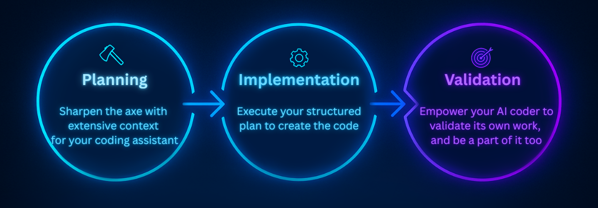

# AI Coding Workshop: The Full AI Development Workflow

## 🎯 Workshop Overview

Welcome to the AI Coding Workshop! Over the next 4 hours, you'll master the complete workflow for building production features with AI assistants in existing codebases.

<p align="center">
  
</p>

### What You'll Learn (Highest Level Mental Model)

1. **Planning** - Context engineering for brownfield development
2. **Implementation** - From vague prompts to production code
3. **Validation** - Ensuring quality with automated review workflows

### What You Will Get

- A Working Stripe integration that we will implement + the full agent SaaS starter template that is yours to keep (incredible production value)
- A library of reusable battle tested PRP templates and reusable workflows used by 1000s of engineers
- Yours to keep context engineering library with reusable prompts, SlashCommands, Subagents and more
- The skills to setup and effectively use AI coding tools in existing and mature projects

### 📅 Workshop Schedule

<table>
<tr>
<th width="100">Section</th>
<th width="300">Focus</th>
<th>What You'll Do</th>
</tr>
<tr>
<td align="center"><b>Section 0</b></td>
<td><b>Introduction & Setup</b></td>
<td>Environment setup, warm-up challenge, explore the codebase</td>
</tr>
<tr>
<td align="center"><b>Section 1</b></td>
<td><b>Planning & Context Engineering</b></td>
<td>Build PRPs, analyze integration points, create implementation roadmap</td>
</tr>
<tr>
<td align="center">☕</td>
<td><i>Break</i></td>
<td><i>Stretch & hydrate</i></td>
</tr>
<tr>
<td align="center"><b>Section 2</b></td>
<td><b>Implementation with PRPs</b></td>
<td>Execute the plan, evolve prompts, integrate Stripe with AI assistance</td>
</tr>
<tr>
<td align="center">☕</td>
<td><i>Break</i></td>
<td><i>Stretch & hydrate</i></td>
</tr>
<tr>
<td align="center"><b>Section 3</b></td>
<td><b>Validation & Review</b></td>
<td>Automated testing, AI code review, ensure production readiness</td>
</tr>
</table>

Ready to transform how you work with AI? Let's begin this journey together.

## 🛠️ Workshop Environment

### Required Tools

You'll need one of these AI coding assistants to follow along in the workshop:

- **Claude Code** (Recommended) - Most autonomous, best for PRPs
- **Cursor** - Great IDE integration, Background Agents
- **Windsurf** - Beginner-friendly, good value
- **Gemini CLI** - Huge context window, generous free tier
- **ANY** - Any AI coding assistant you prefer (bring your favorite)

### MCP Servers that I will use, but you can follow along without it as well

<table>
<tr>
<td width="80" align="center">
  
</td>
<td>
  <b>Archon:</b> Knowledge and task management (setup coming in Section 2)
</td>
</tr>
</table>

---

## 🎯 Workshop Project

Now that you've set up your environment, let's look at what we'll be building together.

### Our Mission: Adding Stripe Payments to an AI SaaS Platform

Throughout this workshop, we'll work with a mature codebase - an AI agent deployment system with:

- **Frontend**: React/TypeScript with real-time streaming
- **Backend**: FastAPI with Pydantic AI agents
- **Database**: Supabase with PostgreSQL
- **Rag**: Retrieval-Augmented Generation (RAG) for context-aware responses

Our challenge: Integrate Stripe subscription billing into this existing system.

<details>
<summary><strong>Deep Dive: About the project we will work on</strong></summary>

### Current Architecture

```
frontend/                    # React 18 + TypeScript + Vite
├── src/
│   ├── components/         # Reusable UI components
│   ├── pages/             # Route components
│   ├── hooks/             # Custom React hooks
│   ├── lib/               # Utilities and clients
│   └── types/             # TypeScript definitions

backend_agent_api/          # FastAPI + Pydantic AI
├── agent.py               # Main agent implementation
├── tools.py               # Agent tools (RAG, search, etc.)
├── agent_api.py           # FastAPI endpoints
└── clients.py             # Service configurations

database/                   # Supabase PostgreSQL
├── users                  # User profiles
├── conversations          # Chat history
├── documents             # RAG knowledge base
└── billing               # What we are adding
```

The codebase already has established patterns we will need to respect:

- **Authentication**: Supabase Auth with JWT tokens
- **API Structure**: RESTful with `/api/` prefix
- **State Management**: React Context for global state
- **Error Handling**: Consistent error boundaries and toast notifications
- **Testing**: Jest for frontend, pytest for backend

</details>

---

## 🌍 Understanding The Current Landscape Of AI Coding Agents

Before we can engineer effective prompts, we need to understand the tools at our disposal. The AI coding assistant you choose will shape how you work, but the principles you'll learn today apply universally.

While this workshop focuses on Claude Code (the most agentic and powerful AI coding assistant that can execute PRPs end-to-end), these context engineering strategies work with any AI coding assistant. The PRP framework, global rules, and example-driven approaches are universal principles that enhance development across all platforms.

Whichever tool you work with or choose it's important that you spend time with that tool, study it and learn your tools specific features and caveats.

For example Claude code has /commands and CLAUDE.md files while curors uses a prompt library and AGENTS.md files.
Understanding the inner workings of your tool will allow you to optimize your prompts and techniques for the best results for your specific tool.

### Primary AI Assistant Selection

Select a tool that you can work with long term, but don't get married to a single tool. The space is in rapid motion and changes on a monthly basis. It's too early to select 1 winner, while it's important to learn your primary it's also important to be flexible enough to adapt to changes and new tools.

Soon we will likely have a shortlist of the actual long term winners, but right now its to early to tell, even though its clear that Claude Code is the current leader in the market.

### Current leaders (in no particular order)

<table>
<tr>
<th colspan="2" align="center"><h4>🖥️ Terminal Based Agents</h4></th>
</tr>
<tr>
<td width="80" align="center">
  
</td>
<td><b>Claude Code:</b> Best for autonomous multi-file operations, complex refactoring, deep codebase understanding</td>
</tr>
<tr>
<td align="center">
  
</td>
<td><b>Gemini CLI:</b> 1M token context window, excellent for large-scale refactoring, most generous free tier (60 req/min)</td>
</tr>
<tr>
<td align="center">
  
</td>
<td><b>Codex CLI:</b> Starting to catch up, will likely be a true contender for the top spot in a near future</td>
</tr>
<tr>
<td align="center">
  —
</td>
<td><b>Aider:</b> Open, BYOK model, Git-native, perfect for privacy-conscious teams</td>
</tr>
<tr>
<th colspan="2" align="center"><h4>🎨 IDE-Integrated Agents</h4></th>
</tr>
<tr>
<td align="center">
  
</td>
<td><b>Cursor ($20/mo):</b> Speed champion, best predictive completion, Background Agent for async tasks</td>
</tr>
<tr>
<td align="center">
  
</td>
<td><b>Windsurf ($15/mo):</b> Most beginner-friendly, simplified agentic mode, best value pricing</td>
</tr>
<tr>
<td align="center">
  
</td>
<td><b>Cline (Free + API):</b> Open-source VS Code extension, MCP marketplace, ultimate customization</td>
</tr>
</table>

<details>
<summary><strong>Deep Dive: More tools and AI Assistant Decision Framework & Tool Stack</strong></summary>

### The Cost Optimization Trap

**The Fundamental Economic Reality:** Subscription-based AI coding tools face an impossible equation - they must charge $20-200/month while paying enterprise API rates to model providers. This forces them to implement aggressive cost optimizations that directly impact user experience.

**Evidence from 2025:**

- Cursor's "Auto mode" routes requests to cheaper models without user control to maintain profitability
- Users get ~225 Sonnet 4 requests on Pro ($20/mo) vs unlimited direct API access with BYOK
- Subscription tools must add 20-50% markup on API costs plus implement usage caps
- Fortune 500 companies are abandoning subscription tools for BYOK due to both security and performance

**The Inevitable Outcome:** As VC funding tightens and subscription tools squeeze margins further, we're seeing:

1. **Quality Degradation**: More aggressive model routing to cheaper alternatives
2. **Feature Restrictions**: Premium models becoming "Ultra-only" at $200+/month
3. **Market Bifurcation**: Power users fleeing to BYOK while casual users accept limitations

**Winners in This Space:**

- **Model Companies** (Anthropic, OpenAI): Direct API access, no middleman costs
- **Open Source BYOK** (Cline, Aider): Zero margin pressure, full model access
- **Losers**: VC-backed subscription tools caught between user expectations and unit economics

The math is simple: When your business model requires restricting access to the very capabilities users are paying for, you're not building a sustainable product - you're managing decline.

### Pro Tips

- **Monitor API usage**: Monitor usage and outcomes, compare before AI adoption and After, measure the value of AI adoption.
- **Use model tiers wisely**: Sonnet for bulk work, Opus for complex logic
- **Don't cheap out on AI for Coding**: Model capabilities directly affects your outcomes, so invest in the right models for your needs.
- **Avoid annual plans**: AI tools evolve too fast for long commitments

### Coding Agents Honorable mentions:

<table>
<tr>
<th align="center">🖥️ Terminal</th>
<th align="center">🎨 IDE</th>
<th align="center">🔄 Hybrid</th>
</tr>
<tr valign="top">
<td>
  <ul>
    <li><b>Opencode</b><br/>Opensource CLI similar to claude code</li>
    <li><b>Qwen Coder CLI</b><br/>Similar to other Cli Coders</li>
  </ul>
</td>
<td>
  <ul>
    <li><b>Zed</b><br/>Rust based IDE with AI features</li>
    <li><b>Roo Code</b><br/>VScode extension with AI features</li>
    <li><b>Kiro</b><br/>VS Code Fork with AI features</li>
  </ul>
</td>
<td>
  <ul>
    <li><b>Augment Code</b><br/>AI software development platform</li>
    <li><b>Warp</b><br/>Terminal AI software development platform with AI features</li>
    <li><b>Devin</b><br/>The First Autonomous Coding Agent</li>
  </ul>
</td>
</tr>
</table>

### Best Coding Models

<table>
<tr>
<th width="80" align="center">Logo</th>
<th>Model & Description</th>
</tr>
<tr>
<td align="center">
  
</td>
<td>🥇 <b>Claude 4 Sonnet & Opus:</b> Current coding champion, worth the premium</td>
</tr>
<tr>
<td align="center">
  
</td>
<td>🥈 <b>GPT-5 & GPT-5-codex:</b> Good value, Reliable all-rounder, excellent at detailed instruction following</td>
</tr>
<tr>
<td align="center">
  
</td>
<td>🥉 <b>Gemini 2.5 Pro:</b> Best value (20x cheaper than Claude), 1M token context</td>
</tr>
<tr>
<td align="center">
  —
</td>
<td>4+ <b>Other Models:</b> Viable but require more human intervention as capabilities decrease</td>
</tr>
</table>

### When to Use What

**Choose Terminal (Claude Code/Gemini CLI) when:**

- Doing large-scale refactoring across many files
- Need autonomous operation with minimal supervision
- Working with complex monorepos requiring deep understanding
- Prefer command-line workflows and scripts

**Choose IDE (Cursor/Windsurf) when:**

- Want real-time code completion in the IDE and error checking
- Doing rapid feature development with quick iterations (eg. Prototyping, exploring new ideas, experimenting with new frameworks)
- Need familiar GUI interface with visual diff tools

**Choose Hybrid Approach when:**

- When you want the best of both worlds
- Want to test something new

</details>

---

## 🔧 Supporting Tools Stack

Beyond your primary AI assistant, you can extend capabilities with additional tools.

### Extend your coding agent with MCP servers

MCP servers allow you to connect your coding agent with MCP servers to extend its capabilities.
Connect the tools you use daily to let your coding agent directly interact with them.

**Essential MCP Servers:**

- **Playwright/Puppeteer MCP/browser mcp**: Browser automation and E2E testing
- **Archon**: Context Crawling and management, project and task tracking, RAG tools
  db management mcp

---

## 🧠 Context Engineering: The Four Pillars

Now we arrive at the heart of effective AI coding - Context Engineering. This is what separates vague prompting from systematic, reproducible success.

<table border="0">
<tr>
<td width="35%" valign="top">

</td>
<td width="65%" valign="top">

Successful AI coding relies on **Context Engineering** - giving your AI system everything it needs to succeed. This consists of four foundational pillars:

**1. RAG (Retrieval-Augmented Generation)**
Access to real-time documentation and codebase knowledge through web search, Archon, and other tools. Prevents hallucinations by grounding responses in verified information.

**2. Task Management**
Structured tracking of development work via Archon, Claude Taskmaster MCP, and built-in tools like TodoWrite. Maintains focus and provides visibility into progress throughout complex projects.

**3. Memory**
Persistent context across sessions including conversation history, project state, and architectural decisions. Enables coherent multi-step workflows without repetitive explanations.

**4. Prompt Engineering**
Structured approaches like the PRP framework (our focus), GitHub Spec Kit, Context Forge, and the BMAD Method that guide AI behavior. Determines output quality and ensures reproducible results.

</td>
</tr>
</table>

### Key Insights

Context engineering is evolving from "prompt engineering" to comprehensive system design. What we must realize as engineers: **AI failures are rarely model failures anymore - they're context failures**. That's why as engineers we must learn these new concepts and tools.

The goal isn't the most sophisticated method, but matching the approach to your needs and gradually increasing your own and your teams skills as your AI-assisted development matures.

<details>
<summary><strong>📚 Common Context Engineering Methods</strong></summary>

Context engineering is the discipline of systematically providing AI coding assistants with the right information at the right time. From manual approaches to sophisticated frameworks:

### Manual Context Management (No Framework)

<details>
<summary><strong>Copy-paste and manual description approach</strong></summary>

- Copy-paste relevant code snippets directly into prompts
- Manually describe project structure and dependencies
- Explain business logic and requirements in natural language
- Share documentation links and API references as needed

</details>

### Semi-Automated Context Gathering

<details>
<summary><strong>Using AI to help organize and maintain context</strong></summary>

- Use AI assistants to analyze codebase and create documentation
- Generate project summaries and architecture diagrams with AI help
- Create context files with AI assistance (README, ARCHITECTURE.md)
- Multi-Claude collaboration (one writes, another reviews)

</details>

### Structured Context Frameworks

#### **GitHub Spec Kit**

<details>
<summary><strong>Spec-driven development toolkit from GitHub</strong></summary>

Makes specifications the center of the engineering process.

- **Four-phase process**: Specify → Plan → Tasks → Implement
- **Living specifications**: Evolve alongside code as active documentation
- **Multi-variant implementations**: Create different implementations from same spec
- **Templates for multiple AI assistants**: Copilot, Claude Code, Gemini CLI, Cursor, etc.
- **CLI with validation checkpoints**: Move through phases only after validation

</details>

#### **PRP (Product Requirements Prompt)**

<details>
<summary><strong>PRD + Codebase Intelligence + Agent Runbook framework</strong></summary>

Combines Product Requirements Documents with curated codebase intelligence and agent runbooks.

- **Three core components**: PRD + Codebase Intelligence + Agent Runbook
- **Precise file paths and code examples**: Direct references instead of descriptions
- **Library versions and patterns**: Include implementation context
- **Validation frameworks**: Multi-level testing and quality checks
- **One-pass implementation goal**: Ship production-ready code first try

</details>

#### **BMAD Method**

<details>
<summary><strong>Breakthrough Method for Agile AI-Driven Development</strong></summary>

Uses specialized AI agents for different roles.

- **Agentic Planning**: Analyst, PM, and Architect agents collaborate
- **Role-specific context**: Each agent receives tailored information
- **Structured workflows**: Pre-defined handoff prompts between agents
- **Multi-domain support**: Beyond software to creative, business, educational
- **CLI tooling and Web UI**: Version 4 includes full agent-driven planning

</details>

#### **Context Forge**

<details>
<summary><strong>Context scaffolding and documentation toolkit</strong></summary>

- Scaffolds context documentation for Claude Code projects
- Tech-stack specific templates with validation
- Transforms requirements into staged implementation plans
- Deep integration with Claude Code hooks

</details>

#### **Claude-Flow**

<details>
<summary><strong>AI orchestration with swarm intelligence</strong></summary>

- **Hive-mind coordination**: Queen agent orchestrates specialized workers
- **27+ cognitive models**: Neural pattern recognition with WASM acceleration
- **87 MCP tools**: Comprehensive automation toolkit
- **Dynamic Agent Architecture**: Self-organizing with fault tolerance
- **SQLite memory system**: Persistent storage across sessions

</details>

#### **Cline Memory Bank**

<details>
<summary><strong>Persistent context management for VS Code</strong></summary>

- **Hierarchical markdown structure**: Project brief, tech context, patterns, progress
- **Self-documenting projects**: Documentation created as side effect
- **Two implementation modes**: Native .clinerules or MCP server
- **Session state preservation**: Maintain context across new conversations
- **Mermaid workflow diagrams**: Formal language for process description

</details>

#### **ContextKit**

<details>
<summary><strong>Four-phase methodology for structured AI development</strong></summary>

- **Define Phase**: What to build without technical details
- **Plan Phase**: Technical architecture and approach
- **Execute Phase**: Supervised autonomy with quality agents
- **Validate Phase**: Automatic cleanup and quality checks

</details>

</details>

---

## 🎯 Time for Practice: The Git Branch Cleaner Challenge

Theory is important, but nothing beats hands-on experience. Before we dive into our main Stripe integration project, let's test your current prompt engineering skills with a focused challenge.

### Why This Challenge?

This exercise will reveal your current prompting habits - where you're specific and where you leave room for interpretation. **Don't worry if your first attempt doesn't produce perfect code.** That's exactly the point. By seeing the gap between what you intended and what the AI produced, you'll immediately understand why the techniques in this workshop matter.

### The Challenge

Your task is to write a prompt that makes your AI coding assistant create a **Git Branch Cleaner** script. The goal is to practice writing clear, specific prompts that result in working code on the first try.

### Requirements

You can write this in any preffered languyage

The script should:

1. **Single File** the script must be contained in a single file
2. **List all local git branches** with their last commit dates
3. **Identify stale branches** (not touched in 30+ days)
4. **Identify merged branches** (already merged into main/master)
5. **Display a summary** with color-coded output
6. **Offer interactive deletion** with confirmation

<details>
<summary><strong>Effectively Prompt Coding Agents: Deep Dive</strong></summary>

## The Science of Effectively Prompting Coding Agents

Effective prompting isn't about being clever or creative - it's about **eliminating interpretation overhead**. Every ambiguous word forces the AI to make decisions, and each decision is a potential divergence from your intent.

### Core Principles of Effective Prompting

#### 1. **Action Verbs as Executable Commands**

Transform vague requests into mechanical instructions:

- ❌ **Weak**: "The script should handle errors"
- ✅ **Strong**: `ENSURE: Wrap all operations in try/except subprocess.CalledProcessError`
- 💪 **Strongest**: `IMPLEMENT: try/except with specific error message "Git repository not found at {path}"`

Each level removes interpretation. The strongest version is copy-paste ready.

#### 2. **Specification Density Over Brevity**

Information density ≠ Short prompts. It means every word carries specific, actionable information:

```
❌ "Make it user-friendly with nice colors"
    - "user-friendly" = ???
    - "nice" = subjective
    - "colors" = which ones?

✅ "IMPLEMENT: Colorama with Fore.RED for errors, Fore.GREEN for success, Fore.YELLOW for warnings"
    - Library: specified
    - Color mapping: exact
    - Use cases: defined
```

#### 3. **Data Structure Definitions**

Ambiguous data leads to implementation variance:

```
❌ "Return branch information"

✅ "RETURN: Dict[str, Dict[str, Any]] with structure:
    {branch_name: {
        'days_old': int,
        'is_merged': bool,
        'commit_hash': str (7 chars),
        'last_commit_date': datetime
    }}"
```

### Advanced Prompt Engineering Patterns

#### **Goal-Driven Context**

Adding explicit goals transforms execution quality:

```
GOAL: Single-file script runnable without installation
WHY: Engineers need quick branch cleanup without setup friction
SUCCESS: Script executes correctly on first run in any git repository
```

This context helps the AI make consistent micro-decisions aligned with your intent.

#### **User Persona Targeting**

Define who will use the output:

```
USER: Senior engineers managing 50+ branches across multiple projects
NEEDS: Fast identification of truly stale work, not just old branches
WORKFLOW: Run weekly during sprint planning to maintain repository hygiene
```

This shapes interface decisions, error messages, and feature priorities.

#### **Success Metrics Definition**

Quantifiable success criteria eliminate subjective interpretation:

```
SUCCESS METRICS:
- Execution time: <2 seconds for 100 branches
- Memory usage: <50MB for large repositories
- Error rate: 0% false positives on branch identification
- User actions: Maximum 3 interactions to complete deletion
```

#### **Anti-Pattern Documentation**

Explicitly state what NOT to do:

```
ANTI-PATTERNS to AVOID:
- ❌ Don't use recursive git operations (performance)
- ❌ Don't cache branch data (must be real-time)
- ❌ Don't auto-delete without confirmation (safety)
- ❌ Don't hardcode branch names (flexibility)
```

### Why Some Prompts Fail

Understanding why prompts fail helps write better ones:

1. **Assumption Cascade**: One vague term triggers a chain of interpretations
2. **Context Pollution**: Irrelevant information dilutes critical instructions
3. **Validation Gaps**: No way to verify intermediate steps
4. **Specification Conflicts**: Contradictory requirements force arbitrary choices
5. **Implicit Dependencies**: Assuming knowledge not provided in prompt

### The Ultimate Test

A well-crafted prompt should be **mechanically executable** by a human:

- No interpretation required
- No decisions needed beyond the specified
- Clear validation at each step
- Deterministic outcome

If another developer could follow your prompt without asking questions, an AI can likely execute it perfectly.

Master this, and you'll achieve consistent first-pass success with AI coding assistants.

</details>

Modern LLMs are remarkably capable when given clear instructions. The key is learning how to provide those instructions effectively.

---

📚 **Using This Document**: Start with the content outside chevrons for the workshop flow. After the workshop, explore one chevron section per day to deepen your understanding.

---

# ➡️ Now, let's move to Section 1: Planning!

In Section 1, we'll take everything you've learned and apply it to planning our Stripe integration using the PRP framework.

---

# Section 1: Planning Your AI Development

<p align="center">
  
</p>

## 📋 The Two-Layer Planning Foundation

Successful AI-assisted development requires planning at two distinct levels that work together to create a comprehensive context for your AI agent.

### Layer 1: Project Planning (One-Time Foundation)

This is your stable foundation - set once when you start, then refined as you learn. For our brownfield Stripe integration, we need to understand what already exists.

#### 🎯 Project Vision Alignment

- **Review existing mission**: What is the project's current purpose?
- **Feature positioning**: How does Stripe billing serve the larger vision?
- **Constraint mapping**: What patterns and decisions must we respect?

#### 🔍 Discovery Phase (What We'll Do Together)

- **Pattern recognition**: Identify existing auth, API, and data patterns
- **Integration touchpoints**: Find where billing connects to users, subscriptions
- **Component inventory**: What can we reuse vs what needs creation?

<details>
<summary><strong>Deep Dive: Full Discovery & Research Process</strong></summary>

**Start with the "why" before the "what" or "how".**

Your approach depends on whether you're starting fresh or working within an existing system.

**🌱 Greenfield Projects (New Projects)**

Create your project's fundamental purpose and boundaries:

- **Vision Statement**: What problem are you solving and why it matters?
- **Mission Statement**: What you'll build and who will use it
- **Project Scope**: Clear boundaries for what you will and won't do

**🏭 Brownfield Projects (Existing Systems)**

Understand the existing project's context and your specific contribution:

- **Existing Vision**: Review the project's current mission, goals, and strategic direction
- **Your Feature's Role**: How does your specific work serve the larger vision?
- **Constraints**: What existing architecture, patterns, and decisions must you work within?

**This workshop focuses on brownfield development** - working within existing codebases where vision and architecture already exist.

This understanding becomes your filter for all decisions - your feature must serve the larger vision while respecting existing constraints.

### Domain Knowledge Research

**Before writing any code, understand your domain deeply.**

The fundamental truth: **If you don't understand what to build and where it fits, you won't be able to explain it to the agent.**

**What to Research:**

- **Industry Standards**: Payment processing best practices, PCI compliance basics
- **Technical Landscape**: Stripe SDK capabilities, webhook patterns, idempotency
- **User Expectations**: Subscription models, billing cycles, payment methods

### Architectural Discovery for Brownfield

**Understanding the existing system is non-negotiable:**

- **Existing Patterns**: What architectural patterns are already in use?
  - Authentication middleware location and structure
  - API endpoint conventions and routing patterns
  - Database transaction handling approaches
  - Error handling and logging standards

- **Integration Points**: How does your feature connect?
  - User service for account linking
  - Email service for billing notifications
  - Admin panel for subscription management
  - Analytics for revenue tracking

- **Technology Constraints**: What must you work within?
  - Framework versions that can't be upgraded
  - Database schemas that other services depend on
  - API contracts that mobile apps consume
  - Security policies and compliance requirements

- **Data Flow Analysis**: How does data move?
  - Request/response patterns
  - Event publishing mechanisms
  - Cache invalidation strategies
  - Session management approach

**The AI Advantage in Discovery:**

Use your agent as a research accelerator:

- "Analyze the user service and identify the authentication pattern"
- "Find all API endpoints that deal with user data"
- "What error handling pattern is used in the payment module?"
- "Generate a Stripe webhook handler following our existing patterns"
- Generate prototypes for learning and testing

</details>

The fundamental truth: **If you don't understand what to build and where it fits, you won't be able to explain it to the agent.**

### ⚙️ Global Rules

Global rules (CLAUDE.md) define foundational principles that remain constant across your entire codebase. This is where you define all best practices, styles, architecture, and patterns of development you want the coding agent to **always** follow. Think of it like the primary system prompt for your AI coding assistant.

<details>
<summary><strong>Deep Dive: Mastering Global Rules and CLAUDE.md</strong></summary>

### What Are Global Rules?

Global rules are project-wide instructions that Claude Code (and other AI assistants) automatically load into context. Unlike PRP which is task-specific, global rules establish permanent behavioral patterns and coding standards.

### CLAUDE.md File Hierarchy

Claude reads files in this order:

1. **Current Directory** (`./CLAUDE.md`) - Project-specific rules
2. **Parent Directories** - Up to repository root for monorepos
3. **Home Directory** (`~/.claude/CLAUDE.md`) - Spans across all projects
4. **Local Override** (`./CLAUDE.local.md`) - Uncommitted personal settings

### What Belongs in Global Rules

**Architecture & Patterns**:

- Design principles (SOLID, DRY, KISS)
- Architectural patterns (MVC, microservices, event-driven)
- Module organization and file structure
- Dependency injection patterns

**Coding Standards**:

- Naming conventions (camelCase, snake_case, PascalCase)
- Code formatting rules (indentation, line length)
- Comment and documentation standards
- Import organization

**Development Practices**:

- Error handling patterns
- Logging conventions
- Security requirements (never hardcode secrets)
- Testing approach (TDD, unit/integration split)

**Anti-Patterns to Avoid (Claude Loves These Things, so Prompt to Avoid Them!)**:

- ❌ Over-engineering simple solutions
- ❌ Backward compatibility for new projects
- ❌ Creating files over 500 lines
- ❌ Mixing concerns in single modules
- ❌ Skipping validation and tests

### Best Practices for CLAUDE.md

**Keep It Concise**: Write for Claude, not onboarding a junior dev

```markdown
# BAD: Long narrative

The project uses React for the frontend framework because we believe...

# GOOD: Direct bullet point

- Frontend: React 18 with TypeScript
```

**Be Specific About Behaviors**:

```markdown
# Project Awareness

- Always read PLANNING.md at conversation start
- Check TASK.md before starting new work
- Mark tasks complete immediately after finishing

# Code Structure

- Never create files > 500 lines
- Split into modules when approaching limit
- Group by feature, not file type
```

**Include Utility Patterns**:

```markdown
# Common Patterns

- Database connections: Use connection pooling via db_pool
- API calls: Always use async/await with proper error handling
- File I/O: Use pathlib for cross-platform compatibility
```

### Advanced Features

**File Importing in Claude Code**

```markdown
<!-- Load entire file content automatically on startup -->

@path/to/patterns.md

<!-- Reference without loading refernce whenever you need it -->

See authentication patterns in: docs/auth.md
```

**Dynamic Updates**:
Press `#` in Claude Code to add new rules on the fly:

```
# Always use pytest for testing, never unittest
```

### Global Rules vs Structured Prompt (like a PRP)

| Global Rules            | Structured Prompt              |
| ----------------------- | ------------------------------ |
| Permanent patterns      | Task-specific requirements     |
| Architecture principles | Feature implementation details |
| Coding standards        | One-time configurations        |
| Security requirements   | Project-specific gotchas       |
| Testing approach        | Specific validation gates      |

### The AGENTS.md Standard

As of 2025, the industry has converged on **AGENTS.md** as the unified standard for AI coding assistant instructions:

- **Universal Adoption**: Supported by 20+ AI coding tools including Claude Code, Cursor, GitHub Copilot, Windsurf, Gemini CLI, and more
- **Single Source of Truth**: One file instead of multiple tool-specific configs
- **Location**: Always at repository root for predictable discovery
- **Format**: Standard Markdown for human and AI readability

**How This Project Manages It**:
```
AGENTS.md                    # Core constants, architecture, integration points
├── Imports detailed patterns from:
└── PRPs/ai_docs/           # Modular documentation
    ├── backend_patterns.md  # Pydantic AI, SSE, tools
    ├── rag_patterns.md      # Pipeline, chunking, embeddings
    ├── frontend_patterns.md # React, Shadcn UI, Supabase
    └── testing_patterns.md  # pytest, Playwright, mocking
```

**Claude Code Integration**:
```markdown
# CLAUDE.md (minimal, just points to AGENTS.md)
@AGENTS.md

# Additional Claude-specific features if needed
ALWAYS follow the rules in @.claude/archon_rules.md
```

This approach keeps core rules universal (AGENTS.md) while allowing tool-specific extensions when necessary.

</details>

### Validating Your Rules

Test your rules file by asking:
"Based on the project rules, how would you implement a new API endpoint?"

If the response doesn't match your patterns, refine the rules.

### If You Don't have Rules Yet, Create Them Now

The project planning phase is the perfect place to create your rules with the help of an AI coding assistant because you're in a conversation where it understands your current codebase (brownfield) or your project vision and tech stack (greenfield).

### 🌐 Archon Integration

In The workshop we are using Archon to help our Agent get the right context from the Stripe and Supabase documentation.

Archon serves as the command center for AI coding assistants, giving them a comprehensive knowledge and task management system. We as the humans manage the knowledge, tasks, and documents through a sleek UI, and the AI coding assistant accesses and manages the same knowledge, tasks, and documents through the MCP server. It's real-time collaboration at its finest.

<details>
<summary><strong>Deep Dive: Leveraging Archon for AI Development</strong></summary>

### What is Archon?

[Archon](https://archon.diy) is the knowledge and task management backbone for AI coding assistants. It provides a sleek interface to manage knowledge, context, and tasks while functioning as an MCP server for AI collaboration. Click the Archon link above to get to the README which includes installation and setup instructions.

### Architecture Overview

```
┌─────────────────┐    ┌─────────────────┐    ┌─────────────────┐    ┌─────────────────┐
│ Frontend UI     │    │ Server (API)    │    │ MCP Server      │    │ Agents Service  │
│ React + Vite    │◄──►│ FastAPI +       │◄──►│ Lightweight     │◄──►│ PydanticAI      │
│ Port 3737       │    │ SocketIO        │    │ HTTP Wrapper    │    │ Port 8052       │
│                 │    │ Port 8181       │    │ Port 8051       │    │                 │
└─────────────────┘    └─────────────────┘    └─────────────────┘    └─────────────────┘
                                │                                        │
                                └────────────────┬───────────────────────┘
                                                 ▼
                                       ┌─────────────────┐
                                       │ Database        │
                                       │ Supabase        │
                                       │ PostgreSQL      │
                                       │ PGVector        │
                                       └─────────────────┘
```

### Core Features

**Knowledge Management**:

- **Smart Web Crawling**: Automatically crawls documentation sites
- **Document Processing**: PDF, Word, markdown with intelligent chunking
- **Vector Search**: Advanced semantic search with contextual embeddings
- **Hybrid Search**: Combines vector and keyword matching

**Task Management**:

- Project creation and organization
- Task tracking with status updates
- Document versioning and history
- Feature tracking and dependencies

### MCP Integration

Archon provides MCP tools for comprehensive functionality, including:

**RAG Operations**:

- `perform_rag_query`: Search knowledge base with reranking
- `search_code_examples`: Find relevant code patterns
- `get_available_sources`: List indexed documentation

**Project Management**:

- `create_project`: Initialize new projects
- `list_projects`: View all projects
- `update_project`: Modify project details

**Task Operations**:

- `create_task`: Add new tasks with dependencies
- `list_tasks`: Filter by status, project, assignee
- `update_task`: Change status, assignee, priority

### Workflow Integration

**Setup in Claude Code**:

```bash
# Add Archon MCP server
claude mcp add archon http://localhost:8051/mcp

# Or when in a dev container: claude mcp add archon http://host.docker.internal:8051/mcp

# Verify connection
claude mcp list
```

**Using Archon in PRPs**:

```yaml
# In your PRP context section
mcp: Archon
query: "Pydantic AI agent patterns"
why: Get latest documentation and examples
```

**Task Management Flow**:

1. Create project for your agent development
2. Generate tasks from PRP requirements
3. Update task status as you progress
4. Use RAG for documentation lookup
5. Track feature completion

### Benefits for AI Development

- **Centralized Context**: Single source of truth for all documentation
- **Team Collaboration**: Shared knowledge base and task tracking
- **Advanced RAG**: Semantic search with reranking for better results
- **Version Control**: Track document and requirement changes
- **Real-time Updates**: Live collaboration via Socket.IO

### Current Status

Archon is in beta with active development. Join the community in [GitHub](https://github.com/coleam00/Archon) for updates and contributions.

</details>

<details>
<summary><strong>🔌 MCP Servers - Connect Your Entire Tool Stack</strong></summary>

### Transform Claude into Your Unified Development Hub

MCP servers let you connect your existing business tools directly to Claude Code, creating a seamless workflow that never leaves the terminal. This is where AI coding becomes truly transformative for enterprise teams.

### The Game-Changing Workflow

```
Planning Phase:
├── Pull requirements from Jira/Linear
├── Gather context from Confluence docs
├── Review discussions from Slack threads
└── Access company-specific documentation

Implementation Phase:
├── Reference internal wikis and standards
├── Query production databases safely
└── Access private npm/pip registries
└── Use company-specific tooling

Post-Implementation:
├── Update Jira tickets automatically
├── Create Confluence documentation
├── Send Slack updates to team
└── Trigger CI/CD pipelines
```

### Connect Your Business Tools

**Project Management**:

- **Jira MCP**: Pull tickets, update status, add comments
- **Linear MCP**: Sync issues, create tasks, update cycles
- **Asana MCP**: Task management and project tracking
- **Monday MCP**: Board updates and automation

**Documentation & Knowledge**:

- **Confluence MCP**: Read/write documentation, search knowledge base
- **Notion MCP**: Access team wikis, update project docs
- **SharePoint MCP**: Enterprise document management
- **Google Drive MCP**: Access shared docs and sheets

**Communication**:

- **Slack MCP**: Send updates, read threads, notify channels
- **Discord MCP**: Team notifications and bot interactions
- **Microsoft Teams MCP**: Enterprise communication
- **Email MCP**: Send project updates and reports

**Development Infrastructure**:

- **GitHub/GitLab/Bitbucket MCP**: Beyond git - issues, PRs, CI status
- **Jenkins MCP**: Trigger builds, check pipeline status
- **Docker MCP**: Container management and deployment
- **Kubernetes MCP**: Cluster operations and monitoring

### Real-World Integration Examples

#### Planning Phase Context Gathering

```bash
> Gather context for the payment feature from our tools

Claude (using MCP servers):
1. Queries Jira for ticket PROJ-123 details
2. Searches Confluence for "payment integration" docs
3. Reads Slack #payments channel recent discussions
4. Pulls database schema from PostgreSQL MCP
5. Compiles comprehensive context for PRP generation
```

#### Post-Implementation Communication

```bash
> Update the team about the completed feature

Claude (using MCP servers):
1. Updates Jira ticket to "In Review"
2. Creates Confluence page with implementation details
3. Sends Slack message: "Payment feature ready for review"
4. Triggers Jenkins CI/CD pipeline
5. Updates Linear roadmap milestone
```

</details>

---

### Layer 2: Task-Level Planning (Per Feature)

With project rules established, each feature needs its own focused planning. This is where we get specific about the Stripe integration.

Every new feature, bug fix, or enhancement requires its own mini-planning cycle. This is where project-level decisions meet specific implementation details.

#### 📋 Product Requirements Document (perfect for larger features or refactoring tasks)

**The foundation of any successful project - AI-assisted or traditional.**

A PRD or Spec document crystallizes your vision into actionable specifications that both humans and AI agents can understand and execute against. This document is built on the insights from your discovery phase.

Wheater you use a PRD or not below are the fundamentals:

#### 📋 Task Definition Essentials

- **User Story**: "As a user, I want to manage my subscription"
- **Acceptance Criteria**: Specific, testable requirements
- **Integration Points**: Which services and components are affected?

#### 🔗 Integration Mapping

- **Touch points**: User service, database, frontend components
- **Reusable elements**: Existing API client, auth middleware
- **New requirements**: Webhook endpoints, Stripe service layer

<details>
<summary><strong>Deep Dive: Complete Task Planning Process and PRD details</strong></summary>

**Core PRD Components:**

- **Problem Statement**: What specific problem are you solving? Why does it matter?
- **User Personas**: Who will use this? What are their pain points?
- **Success Metrics**: How will you measure success? (KPIs, user adoption, performance)
- **Core Features**: The must-have functionality with acceptance criteria
- **Scope & Non-Scope**: What's in v1? What's explicitly NOT included?
- **Technical Constraints**: Platform requirements, performance needs, security
- **Dependencies**: External services, APIs, data sources
- **Milestones**: Key deliverables

**Why PRDs Matter for AI Coding:**

- **Clear Context**: AI agents perform better with well-defined requirements
- **Prevents Scope Creep**: Both you and the AI stay focused on defined goals
- **Validation Framework**: Success criteria become your test cases
- **Communication Tool**: Aligns AI output with stakeholder expectations

### Translating PRD to AI Context

Your PRD becomes the foundation for your AI agent interactions:

1. **Feature → Prompt**: Each PRD feature becomes a focused AI task
2. **Acceptance Criteria → Validation**: Your criteria become test cases
3. **Constraints → Rules**: Technical constraints become project rules
4. **Dependencies → Context**: External deps become part of agent context

**Becomes AI Context:**

- Break your PRD into smaller, manageable tasks
- Each task becomes a separate AI prompt or PRP (more on that later)
- Use AI to generate code snippets for each task
- Combine snippets into a cohesive solution

### PRD as Living Document

With AI coding, your PRD evolves:

- Start with high-level requirements
- Use AI to explore technical feasibility
- Refine based on prototype findings
- Update constraints based on discoveries
- Document decisions and trade-offs
- Save in your codebase for easy reference and future updates with AI assistance

#### 🔗 Integration Planning

**Understand how this task fits into the existing codebase.**

Before implementation, map out:

- **Touch Points**: Which files/modules will change?
- **Reusable Components**: What already exists that you can leverage?
- **Patterns to Follow**: Which existing patterns apply?
- **Impact Analysis**: What might break? What needs testing?

### The Risk of Skipping Integration Analysis

Without this understanding, your AI agent will:

- **Duplicate existing logic** instead of reusing utilities
- **Create files in wrong locations** breaking project structure
- **Reinvent patterns** that already exist in your codebase
- **Miss integration points** with existing features
- **Violate conventions** established by your team

### Your Role as the Guide

You must understand your project well enough to:

- Point the agent to existing utilities ("use the auth middleware in `/utils/auth.js`")
- Specify integration patterns ("follow the same repository pattern as the user service")
- Identify reusable components ("extend the base API client in `/lib/api`")
- Enforce architectural decisions ("this belongs in the application layer, not domain")

</details>

---

<p align="center">
  
</p>

## 🧠 Context Engineering: From Vibe Planning to PRP

Now we transform our planning into one or more actionable prompts. For this we will use the PRP (Product Requirements Prompt) framework. This will help us package our planning and discovery learnings into an executable prompts for AI agents. Basically taking our initial requirements (a PRD) and turning into a structured prompt for the AI coding assistant.

### What is PRP?

Created by Rasmus Widing, a product manager who has been diving deep into AI coding for over a year now, PRP provides everything an AI needs to deliver production-ready software.

### Core Components

**PRP = PRD + Curated Codebase Intelligence + Agent Runbook**

The framework includes:

- **Business Context**: Domain, requirements, and success criteria
- **Technical Context**: File paths, library versions, code patterns, architecture, and best practices
- **Implementation Blueprint**: Step-by-step development approach
- **Validation Framework**: Testing strategy and acceptance criteria

<details>
<summary><strong>Deep Dive: Mastering the PRP Framework</strong></summary>

### PRP Structure

```markdown
## Goal

[What needs to be built - specific end state]

## Why

[Business justification and user value]

## What

[Detailed feature specification with success criteria]

## All Needed Context

- Documentation links and references
- File paths and existing code patterns
- Library versions and gotchas
- Architecture constraints

## Implementation Blueprint

[Step-by-step development approach]

## Validation Loop

[Testing strategy and acceptance criteria]
```

### The INITIAL.md Starting Point

Before generating a PRP, you describe requirements in `INITIAL.md`. You can have whatever sections you want, but I typically recommend starting with:

- **FEATURE**: Specific description of what to build
- **EXAMPLES**: Reference implementations from examples/ folder
- **DOCUMENTATION**: Links to relevant resources
- **OTHER CONSIDERATIONS**: Gotchas and special requirements

### PRP Generation Process

1. **Create INITIAL.md** with your requirements
2. **Run /generate-prp** to research and create PRP
3. **Review generated PRP** for completeness
4. **Execute with /execute-prp** for implementation

### Why PRP Works

- **Comprehensive Context**: LLMs perform better with complete information
- **Reduced Iterations**: Minimal back-and-forth clarifications
- **Production Ready**: Includes testing and validation from the start

</details>

---

### 🎬 Transitioning to Implementation

With our PRP ready, we validate it before execution:

1. **Quick validation checklist**:
   - Are all referenced files accessible?
   - Do the patterns match our rules file?
   - Is the scope clearly bounded?

2. **The implementation moment**:
   - Load the PRP into your AI assistant using slashcommands
   - Execute the PRP
   - Validate

3. **Why PRP enables single-pass success**:
   - No ambiguity in requirements
   - Clear examples to follow
   - Validation built into process

---

## 📝 Key Takeaways from Planning

✅ **Two-layer planning**: Project-level (once) + Task-level (per feature)

✅ **Rules files**: Codify patterns for consistency

✅ **Discovery first**: Understand before you build

✅ **PRP framework**: Complete context for single-pass implementation

**Next**: Section 2 - Implementation, where planning becomes production code!

---

# Section 2: Implementation with AI

## 🏗️ From PRP to Production Code

With our PRP ready and validated, it's time to transform our comprehensive planning into working code. This is where the magic happens - watching AI assistants execute complex implementations with precision.

While we execute the PRP, the core idea is that you can now start your next planning cycle, or do anything else in the meantime. We have done all of our engineering work up front and now trust (but verify later!) the AI coding assistant to implement our task.

This allows you to scale yourself and your compute advantage. You can run a second PRP in parallel, work on a second project, or even go for lunch.

Our work on this task resumes when the AI agent is done with the implementation.

### 🚀 Executing Your PRP

Simple run the /execute-prp command and pass in your PRP file as an argument.

### 🎯 Slash Commands for repeated workflows

Slash commands automate complex implementation workflows, ensuring consistency across development:

Pro tip: If you find yourself repeating yourself more than 3 times, then write a reusable prompt for it.

<details>
<summary><strong>Deep Dive: Slash Commands and Reusable Workflows</strong></summary>

## Custom Slash Commands: Your Workflow Automation Powerhouse

Slash commands transform repetitive prompts into reusable, shareable workflows. Instead of typing lengthy instructions repeatedly, create once and invoke with `/command-name`.

> Note: Not all AI coding assistants support invoking slash commands (with '/command'), but for any coding assistant that doesn't, you can simply tell the agent to read the slash command and assume those instructions.

### The Power of Systematization

**Why Slash Commands Matter:**

- **Speed**: Complex multi-step operations triggered with a single command
- **Knowledge Capture**: Codify best practices into executable workflows
- **Team Consistency**: Shared commands ensure uniform execution across developers

### Command Architecture

#### Two Scopes, One Workflow

**Project Commands** (`.claude/commands/`)

```bash
# Create team-shared command
mkdir -p .claude/commands
cat > .claude/commands/pr-review.md << 'EOF'
---
description: Comprehensive PR review
allowed-tools: Grep, Read, Bash(npm test:*)
---

Review this pull request for:
1. Code patterns consistency with @CLAUDE.md
2. Test coverage for changes
3. Security vulnerabilities
4. Performance implications

Current changes: !`git diff main...HEAD`
EOF
```

**Personal Commands** (`~/.claude/commands/`)

```bash
# Create personal productivity command
cat > ~/.claude/commands/debug-deep.md << 'EOF'
---
description: Deep debugging analysis
model: claude-3-5-sonnet-20241022
---

Analyze this error systematically:
- Root cause analysis
- Stack trace interpretation
- Similar issues in codebase: !`rg --type py "similar_error_pattern"`
- Proposed fixes with trade-offs
EOF
```

### Advanced Features That Change Everything

#### Dynamic Arguments

```markdown
---
argument-hint: [issue-number] [priority]
---

Fix GitHub issue #$1 with $2 priority:

- Fetch issue: !`gh issue view $1`
- Related code: !`gh issue view $1 --json body -q .body | rg -o 'file:\S+'`
- Create fix following our patterns in @CLAUDE.md
```

#### Bash Integration for Context

```markdown
---
allowed-tools: Bash(git:*), Write, Edit
---

## Current State

- Branch: !`git branch --show-current`
- Status: !`git status --short`
- Recent commits: !`git log --oneline -5`

Based on above, create atomic commit with conventional commit message
```

#### File References with @

```markdown
Review @src/api/handlers.py against patterns in @docs/api-standards.md
Ensure consistency with @src/api/base.py
```

### Real-World Production Workflows

#### Example. **The TDD Cycle**

```markdown
# .claude/commands/tdd.md

---

## description: Test-driven development cycle

For feature "$ARGUMENTS":

1. Write failing test first
2. Implement minimum code to pass
3. Refactor while keeping green
4. Update documentation

Follow testing patterns in @tests/README.md
```

### Namespacing for Scale

Organize commands with subdirectories:

```
.claude/commands/
├── dev/
│   ├── review.md      # /dev:review
│   └── refactor.md    # /dev:refactor
├── test/
│   ├── unit.md        # /test:unit
│   └── e2e.md         # /test:e2e
└── deploy/
    ├── staging.md     # /deploy:staging
    └── production.md  # /deploy:production
```

### Best Practices from the Field

**1. Start Simple, Evolve Gradually**

- Begin with your most repeated tasks
- Add complexity as patterns emerge
- Refactor commands like you refactor code

**2. Use Frontmatter for Control**

```markdown
---
allowed-tools: Read, Write  # Restrict dangerous operations
model: claude-3-5-haiku-20241022  # Use cheaper model for simple tasks
disable-model-invocation: true  # Prevent SlashCommand tool access (NEW)
argument-hint: [branch-name] [commit-message]  # Guide usage
---
```

**3. Chain Commands for Complex Workflows**

```markdown
Run these commands in sequence:

1. /test:unit
2. /dev:review
3. /deploy:staging
   Stop if any step fails.
```

### The SlashCommand Tool: Self-Orchestration (NEW)

Claude can invoke your custom commands programmatically:

```
> When you complete implementation, run /validate-integration
> After fixing bugs, execute /test:regression
```

This enables self-driving workflows where Claude orchestrates its own quality checks.

### Token Economics

"MCP tools consume precious context. CLI commands your LLM already knows cost near-zero tokens."

Instead of:

- 55,000 tokens for GitHub MCP tools

Use:

- ~0 tokens: `!gh pr create --title "$1" --body "$2"`

Remember: **Every repeated prompt is a missing slash command.** Start capturing your workflows now.

</details>

### 🤖 Subagents

<details>
<summary><strong>Deep Dive: Claude Code Subagents - Your AI Development Team</strong></summary>

## Subagents: Specialized Workers with Isolated Contexts

Subagents are pre-configured AI specialists that operate in **separate context windows**, preventing pollution of your main conversation while handling specific tasks autonomously.

### The Architecture That Changes Everything

```
Main Claude (Orchestrator)
    ├── research-agent (Planning Phase)
    ├── test-writer (Validation Phase)
    └── code-reviewer (Quality Assurance)

Each with isolated context = No collision, pure focus
```

### Critical Understanding: You Don't Control the Conversation

**The Hidden Communication Layer:**

- You write the subagent's **system prompt** (its personality and instructions)
- Claude writes the **user prompt** (task delegation) - invisible to you
- Subagent responds to Claude, not you directly
- Claude interprets and presents results

This means: **Your subagent prompts must be defensive and explicit about output format.**

### Where Subagents Excel (and Fail)

#### ✅ **PERFECT for Planning Phase**

```markdown
---
name: codebase-analyst
description: Analyzes codebases for patterns and integration points. Use PROACTIVELY when researching existing code.
tools: Grep, Glob, Read
---

You are a codebase analysis expert. When given a feature to research:

1. Search for similar patterns
2. Identify integration points
3. Document findings in structured format

CRITICAL: Return findings as markdown with:

- ## Patterns Found
- ## Integration Points
- ## Files to Reference

Never return vague summaries. Be specific with file paths and line numbers.
```

#### ✅ **EXCELLENT for Validation Phase**

````markdown
---
name: test-validator
description: Runs tests and validates implementation. Use PROACTIVELY after any implementation.
tools: Bash, Read
---

Execute validation systematically:

1. Run syntax checks: `npm run lint`
2. Run type checks: `npm run typecheck`
3. Run tests: `npm test`

OUTPUT FORMAT (required):

```yaml
validation_results:
  syntax: pass/fail
  types: pass/fail
  tests: pass/fail
  errors: [list of specific errors]
```
````

Never mock to make tests pass. Fix actual issues.

#### ⚠️ **DANGEROUS for Implementation Phase**

**Why implementation subagents fail:**

- **Context Loss**: Each subagent starts fresh - no awareness of other changes
- **Overlap Chaos**: Multiple agents editing same files = conflicts
- **Coordination Breakdown**: No direct communication between subagents
- **Output Inconsistency**: Each interprets requirements differently

### The Orchestration Pattern That Works

**Use subagents for discrete, non-overlapping tasks:**

```python
# GOOD: Clear boundaries, no overlap
planning_tasks = [
    "research-agent: Find existing auth patterns",
    "architecture-agent: Document integration points",
    "spec-writer: Create implementation plan"
]

# BAD: Overlapping implementation
implementation_tasks = [
    "backend-agent: Create API endpoints",  # Which endpoints?
    "frontend-agent: Create UI",  # Depends on API
    "database-agent: Create schema"  # Others depend on this
]
```

### Practical Subagent Patterns

#### 1. **The Research Fleet** (Planning)

```markdown
---
name: pattern-finder
description: Finds and documents existing patterns. Use for codebase research.
---

Find patterns matching the requested feature.
Return as structured list with file:line references.
Include code snippets showing the pattern.
```

#### 2. **The Validation Squad** (Testing)

```markdown
---
name: regression-guard
description: Ensures no existing functionality breaks.
---

Run full test suite and compare against baseline.
Document any new failures with stack traces.
Output: PASS/FAIL with specific failure details.
```

#### 3. **The Documentation Scribe** (Post-Implementation)

```markdown
---
name: doc-updater
description: Updates documentation after implementation.
---

Update README, API docs, and inline comments.
Follow existing documentation patterns exactly.
Never create new documentation files unless instructed.
```

### Output Format Control

**Always specify EXACT output format in system prompt:**

```markdown
CRITICAL OUTPUT REQUIREMENTS:

- Use YAML structure for data
- Include specific keys: status, findings, recommendations
- Reference files with full paths
- Never use relative descriptions like "the authentication file"
- If multiple options exist, list ALL with rationale
```

### Coordination Through the Main Agent

Since subagents can't talk to each other, use the main agent as coordinator:

```
You: "Research existing patterns, then create a validation plan"

Main Claude:
1. Delegates to research-agent → Gets structured findings
2. Interprets findings → Creates context
3. Delegates to test-planner → Gets validation strategy
4. Combines results → Presents unified plan
```

Remember: **Subagents are force multipliers for research and validation, but coordination hazards for implementation.** Use them where isolation helps, not where integration matters.

</details>

---

## 📝 Key Implementation Takeaways

✅ **Phased execution**: Never implement everything at once

✅ **Pattern following**: Respect existing code conventions

✅ **Incremental validation**: Test after each phase

✅ **Git checkpoints**: Commit working states frequently


**Next**: Section 3 - Validation, where we ensure production quality!

---

# Section 3: Validation & Quality Assurance

## ✅ Ensuring Production Quality

With AI coding assistants, the mantra is to trust but verify. This is where we do comprehensive verification. Through systematic testing and review, we ensure our Stripe integration meets all requirements and maintains the quality standards of the existing codebase.

The key is to allow the AI agent to test their own work and then to do our own review after!

### 🔍 Multi-Tier Validation Strategy

Our validation approach progresses through five essential levels, each building confidence in our implementation:

```
Level 1: Syntax & Style
    ↓ (must pass)
Level 2: Type Safety
    ↓ (must pass)
Level 3: Unit Testing
    ↓ (must pass)
Level 4: Integration Testing
    ↓ (must pass)
Level 5: Human Review
- Write a test guide for the Human
```

### 🎯 Validation Gates in Your PRP

Every PRP should include executable validation gates:

### Common Validation Pitfalls and tips

- Commands must be executable by the AI coding assistant, AI agents often fail on interactive CLI commands
- Tests depend on existing test fixtures
- Mock strategies must match existing patterns
- Coverage requirements may vary by module
- Integration tests can be executed by the agent using curl commands
- Be careful so your coding assistant does not start editing your core setup or environment when running into issues

---

## 📝 Key Validation Takeaways

✅ **Progressive validation**: Each level builds on the previous

✅ **Automated gates**: Prevent bad code from progressing

✅ **Pattern consistency**: Tests follow existing conventions

✅ **Comprehensive coverage**: Unit + Integration + Human review

---

## What You Built

🎉 **Working Stripe Integration** - Full billing system integrated into existing SaaS

📚 **Reusable Templates** - PRPs and patterns for future features

🛠️ **AI Workflow** - Complete process from planning to production

---

# 🚀 Advanced Features & Beyond

Now that you've mastered the core workflow, explore these advanced capabilities:

<details>
<summary><strong>🪝 Claude Hooks - Automation Triggers</strong></summary>

### What Are Hooks?

Hooks are automation triggers that execute custom commands based on specific events in your Claude Code workflow.

**Available Hook Events**:

- **PreToolUse/PostToolUse**: Before/after tool execution
- **UserPromptSubmit**: When user submits a prompt
- **SessionStart/SessionEnd**: Session lifecycle events
- **Stop/SubagentStop**: Interruption events

**Example Hook Configuration** (in `.claude/settings.local.json`):

```json
{
  "hooks": {
    "PostToolUse": [
      {
        "matcher": "Write|Edit",
        "hooks": [
          {
            "type": "command",
            "command": "ruff check --fix"
          }
        ]
      }
    ],
    "UserPromptSubmit": [
      {
        "hooks": [
          {
            "type": "command",
            "command": "$CLAUDE_PROJECT_DIR/.claude/hooks/validate.sh"
          }
        ]
      }
    ]
  }
}
```

### Practical Hook Examples

**Auto-format on file changes**:

```json
{
  "matcher": "Write|Edit",
  "hooks": [
    {
      "type": "command",
      "command": "prettier --write ${filePath}"
    }
  ]
}
```

**Run tests after implementation**:

```json
{
  "matcher": "implement.*",
  "hooks": [
    {
      "type": "command",
      "command": "npm test ${affectedFiles}"
    }
  ]
}
```

</details>

<details>
<summary><strong>🎨 Output Styles - Customize AI Responses</strong></summary>

### Built-in Styles

Customize how Claude Code responds by modifying its system prompt for different contexts.

**Available Styles**:

- **Default**: Standard software engineering focus
- **Explanatory**: Adds educational "Insights" sections
- **Learning**: Collaborative mode with `TODO(human)` markers

**Usage**:

```bash
# Access style menu
/output-style

# Set specific style
/output-style explanatory
```

### Creating Custom Styles

Create custom styles with `/output-style:new` and save to `~/.claude/output-styles/`:

```markdown
---
name: concise
description: Brief, focused responses
---

Be extremely concise. No explanations unless asked.
Focus on implementation, not theory.
Use bullet points for clarity.
```

**Brownfield-Specific Style**:

```markdown
---
name: legacy-aware
description: Extra careful with existing code
---

Always check for existing patterns before implementing.
Prioritize using existing utilities over creating new ones.
Add deprecation warnings when refactoring.
Document why changes were made.
```

</details>

<details>
<summary><strong>🌳 Git Worktrees for Parallel Development</strong></summary>

### Parallel Implementation Strategy

Use Git worktrees to explore multiple implementation approaches:

```bash
# Create parallel branches
git worktree add -b feature-approach-1 ../approach-1
git worktree add -b feature-approach-2 ../approach-2

# Implement different approaches
cd ../approach-1
# Implementation with approach 1

cd ../approach-2
# Implementation with approach 2

# Compare and merge best approach
git diff approach-1..approach-2
git merge feature-approach-1
```

### AI-Assisted Parallel Development

```bash
# Custom command for parallel development
/prep-parallel stripe-integration 3

# Creates 3 worktrees with different approaches
# Each can be implemented by different AI sessions
# Compare results and choose best

# Execute the feature request on each of the parallel branches
/execute-parallel stripe-integration [path-to-plan] 3
```

</details>

<details>
<summary><strong>🐳 Dev Containers for Safe Experimentation</strong></summary>

### Why Dev Containers?

Dev containers provide isolated environments for AI to operate safely:

- **Network Isolation**: Restrict external access
- **Filesystem Protection**: No host system changes
- **Reproducible Environment**: Same setup for all developers
- **YOLO Mode**: Let AI run any command safely

### Dev Container Configuration

```json
// .devcontainer/devcontainer.json
{
  "name": "AI Coding Workshop",
  "dockerFile": "Dockerfile",
  "features": {
    "ghcr.io/devcontainers/features/node:1": {},
    "ghcr.io/devcontainers/features/python:1": {}
  },
  "customizations": {
    "vscode": {
      "extensions": ["ms-python.python", "dbaeumer.vscode-eslint"]
    }
  },
  "postCreateCommand": "npm install && pip install -r requirements.txt"
}
```

### Using Dev Containers

1. Open VS Code
2. Press `F1` → "Dev Containers: Reopen in Container"
3. Wait for build (first time only)
4. Run Claude Code with full permissions:
   ```bash
   claude --dangerously-skip-permissions
   ```

</details>

---

## 📚 Resources & Next Steps

### Continue Learning

- **Dynamous Community**: A community of early AI adopters all mastering AI agents and AI coding assistants together
- **Video Tutorials**: [Cole's YouTube](https://www.youtube.com/@ColeMedin[) and [Rasmus' YouTube](https://www.youtube.com/@RasmusWiding)

### Your Action Items

1. **Apply to Your Project**: Use PRP framework on your next feature
2. **Create Custom Commands**: Build slash commands and subagents for your workflow
3. **Share Your Experience**: Contribute patterns back to community (Dynamous and YouTube)

### Final Thought

You now possess the skills to leverage AI assistants effectively in real-world codebases. The key is not the tool, but the methodology - systematic planning, precise context, and rigorous validation.

**Remember**: AI amplifies your capabilities, but your expertise guides the direction. Use these tools to build better software, faster, while maintaining the quality your users deserve.

---

## 🙏 Thank You!

Thank you for joining this workshop! You're now equipped to transform how you build software with AI agents.

Keep building, keep learning, and keep pushing the boundaries of what's possible with AI-assisted development!

**Workshop Created by**: Cole Medin and Rasmus Widing
